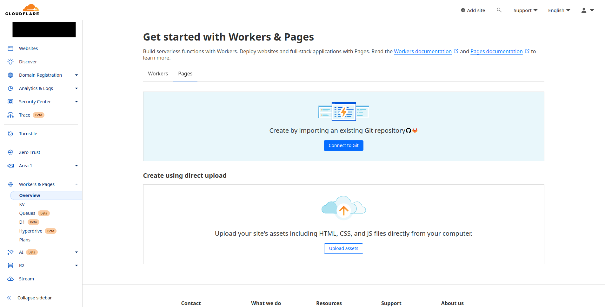
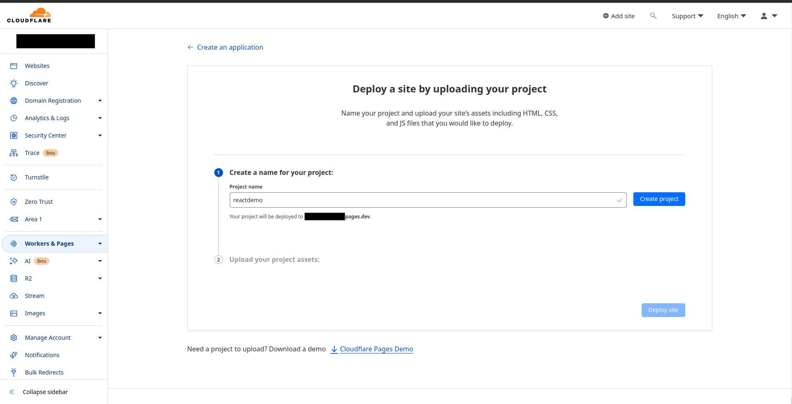
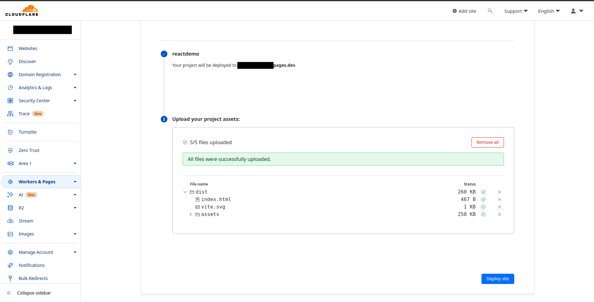
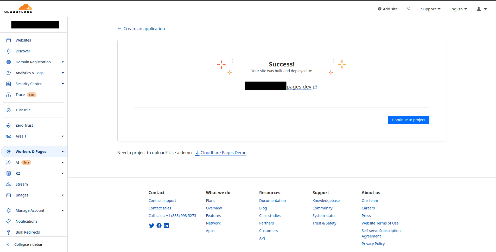
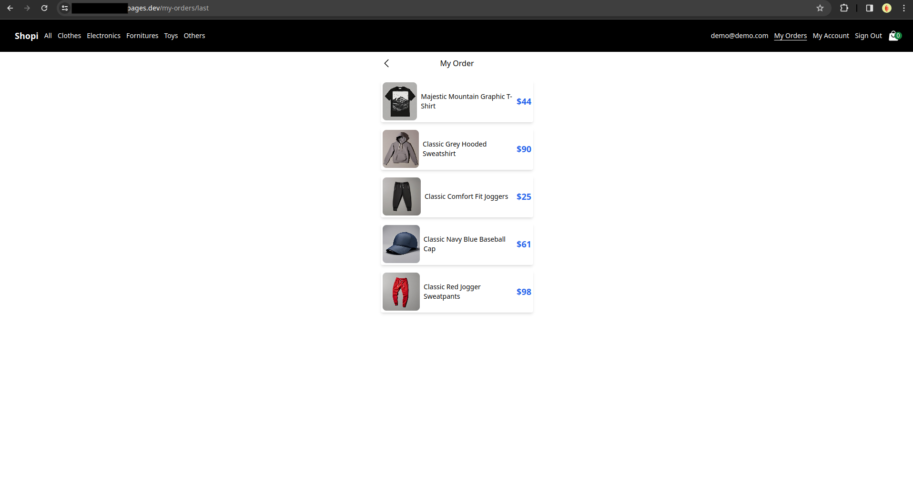

# Publicación de sitio creado con React en Cloudflare Pages

En esta guía se muestran las configuraciones necesarias para publicar un sitio creado en ReactJS dentro de Cloudflare Pages y lograr acceder mediante una URL.

Para este caso se usara el plan Cloudflare Free, para mas información visita [Planes Cloudflare](https://www.cloudflare.com/plans/developer-platform/)

## Requerimientos
- Cuenta en Cloudflare Pages (Plan Cloudflare Free)
- Proyecto en creado React

## Publicación

Para este ejemplo, se va a realizar la publicación directa, para ello es necesario contar con la aplicación lista para build (npm run build).

- Iniciar sesión en [Cloudflare Pages](https://pages.cloudflare.com/)
- Ir a Workers & Pages > Tab de Pages > Create using direct upload > Upload assets

- Crear un nuevo proyecto

- Subir la carpeta de deploy generada previamente, esperar un momento a que se suban todos los archivos

- Dar click en **Deploy site**, esperar un momento y si el proceso es correcto, nos mostrara la URL donde se publico el sitio.

- Y listo, al ingresar en la URL indicada, podemos ver nuestro sitio publicado

