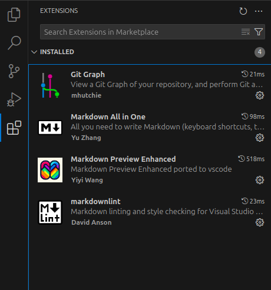
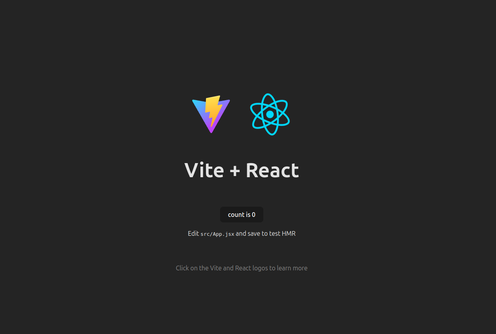

# Entorno Desarrollo React en Linux Mint

En esta guía se muestran las configuraciones para desarrollar React en un sistema Linux Mint 22

## Requerimientos
- Sistema Linux Mint (O derivados de Ubuntu)
- Acceso a terminal

## Software a instalar
- Git
- Visual Studio Code
- Node y NPM

### Instalación de Git

Instalación de Git para realizar un control de versiones adecuado del código que se va a desarrollar con React.

```bash
$ sudo apt install git
```

Comprobar que esta instalado mediante el siguiente comando

```bash
$ git --version

git version 2.43.0
```

Configurar usuario y correo de git

```bash
$ git config --global user.name "User"
$ git config --global user.email email
```

### Instalación de Visual Studio Code

Descargar el paquete .deb desde el sitio web [VSCode](https://code.visualstudio.com/)

Abrir una terminal donde se encuentre el .deb y escribir el siguiente comando, la versión puede ser diferente, ajustar el comando a la correcta descargada.

```bash
$ sudo dpkg -i code_1.96.x_amd64.deb
```

Abrir VSCode, ir a la sección de Extensiones e instalar las que se requieran.
Como recomendación usar **Git Graph** para ver gráficamente el histórico de un repositorio y otras opciones que nos ofrece.



### Instalación de NodeJS y NPM

Para instalar Node en nuestro equipo, se puede hacer de diferentes maneras, en este caso lo usaremos mediante **NVM** que es una herramienta que nos permitirá instalar y gestionar diferentes versiones de Node de una manera mas fácil.

Vamos a la página oficial de instalación de NodeJS y seguimos los pasos que nos indica, [Instalación de Node](https://nodejs.org/en/download)

- Abrimos una terminal y escribimos el siguiente comando para instalar NVM.
```bash
$ curl -o- https://raw.githubusercontent.com/nvm-sh/nvm/v0.40.2/install.sh | bash
```
- Actualizamos las configuraciones de NVM
```bash
$ \. "$HOME/.nvm/nvm.sh"
```

- Descargamos NodeJS, para este caso se usa la versión LTS que en este momento es la 22, pero se puede usar una versión posterior.
```bash
$ nvm install 22
```

- Si nos nos marca algun error, ya tenemos instalado NodeJS en la versión que indicamos, para revisar la versión ejecutamos el siguiente comando.

```bash
$ node -v 
v22.14.0
```

- Verificamos la versión de NPM instalada.
```bash
$ npm -v
10.9.2
```

## Creación de proyecto de ejemplo con Vite

- Para crear un proyecto de React vamos a usar Vite, para ello, abrimos una terminal y escribirmos el siguiente comando.
```bash
$ npm create vite@latest
```

- Si es la primera ves que ejecutamos este comando en nuestro sistema, nos solicita instalar vite, para realizarlo escribimos (y) y presionamos enter.
```bash
Need to install the following packages:
create-vite@6.3.1
Ok to proceed? (y) 
```

- Al terminar la instalación, lo primero que nos solicita es el nombre del proyecto, aqui colocamos el que deseamos, en este caso **vite-react** y enter.
```bash
◆  Project name:
│  vite-react
└
```

- El siguiente paso es seleccionar el framework para este proyecto, seleccionamos React y enter.

```bash
◆  Select a framework:
│  ○ Vanilla
│  ○ Vue
│  ● React
│  ○ Preact
│  ○ Lit
│  ○ Svelte
│  ○ Solid
│  ○ Qwik
│  ○ Angular
│  ○ Others
└
```

- En la variante, seleccionamos JavaScript + SWC y enter.
```bash
◆  Select a variant:
│  ○ TypeScript
│  ○ TypeScript + SWC
│  ○ JavaScript
│  ● JavaScript + SWC
│  ○ React Router v7 ↗
└
```

- Con esto, creamos un nuevo proyecto con vite y react, el siguiente paso es ingresar a la carpeta creada y ejecutar los siguientes comandos:

```bash
$ cd vite-react
```

- Instalamos las dependencias necesarias de Node, este proceso puede tarda un momento.
```bash
$ npm install
```

- Al iniciar el proyecto, nos indica una URL de localhost y un puerto, la cual al ingresar en el navegador deseado (Firefox, Chrome, Egde, etc) se nos muestra el sitio por default que se creo con vite.
```bash
$ npm run dev

  VITE v6.2.2  ready in 111 ms

  ➜  Local:   http://localhost:5173/
  ➜  Network: use --host to expose
  ➜  press h + enter to show help

```



De esta manera, tenemos configurado e iniciado un proyecto en React en un sistema GNU/Linux basado en Ubuntu, los siguientes pasos es abrir el proyecto en el editor deseado, en este caso puede ser VSCode que instalamos y comenzar a desarrollar tus ideas.

## Referencias 

[Instalación de Node](https://nodejs.org/en/download)
[Vite](https://vite.dev/)