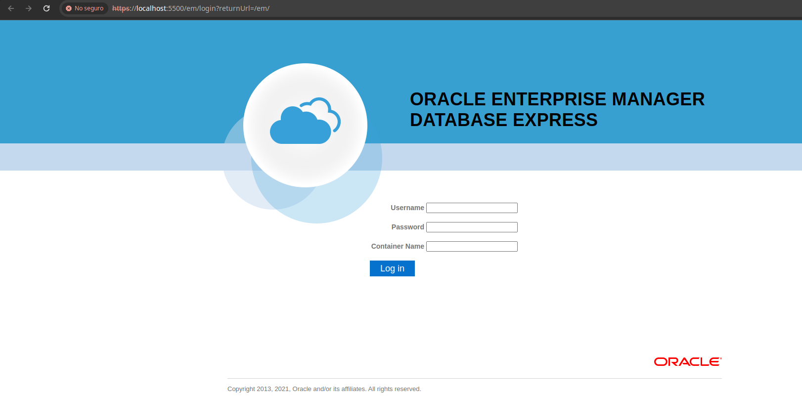

# Instalación de OracleDB Express 21c en Docker

- [Página inicial](/)
{.links-list}

En esta guía se muestran las configuraciones necesarias para instalar OracleDB Express 21c con Docker en el sistema Debian.

## Requerimientos
- Sistema operativo Debian 11
- Docker

## Instalación Docker

```bash
sudo apt-get update

sudo apt-get install \
    ca-certificates \
    curl \
    gnupg \
    lsb-release
```

```bash
sudo mkdir -p /etc/apt/keyrings

curl -fsSL https://download.docker.com/linux/debian/gpg | sudo gpg --dearmor -o /etc/apt/keyrings/docker.gpg
```

```bash
echo \
  "deb [arch=$(dpkg --print-architecture) signed-by=/etc/apt/keyrings/docker.gpg] https://download.docker.com/linux/debian \
  $(lsb_release -cs) stable" | sudo tee /etc/apt/sources.list.d/docker.list > /dev/null
```

```bash
sudo apt-get update
```

```bash
sudo apt-get install docker-ce docker-ce-cli containerd.io docker-compose-plugin
```

## Instalación OracleDB

- Crear el directorio donde se colocan los archivos de Docker, por ejemplo:

```bash
mkdir /configuracionDocker
cd /configuracionDocker
mkdir OracleDB
```

- Crear la carpeta de datos de OracleDB

```bash
cd /configuracionDocker/OracleDB
mkdir data
chmod -R 777 data
```

- Iniciar el contenedor (como root)
```bash
cd /configuracionDocker/OracleDB

docker run -d --name oracleDB \
-p 1521:1521 -p 5500:5500 \
-e ORACLE_PWD=tu-password \
-v /configuracionDocker/OracleDB/data:/opt/oracle/oradata \
container-registry.oracle.com/database/express:21.3.0-xe
```

- Con esta configuración, los datos de la imagen se crean en el directorio indicado, en este caso */configuracionDocker/OracleDB/data* , el nombre del contenedor es oracleDB, para la conexión se indica en el puerto 1521 (se puede cambiar) y el puerto de acceso web 5500.

- Al ejcutar el comando, la primera vez va a descargar la imagen de oracle, aproximadamente 3 GB

- Ver los contenedores que se estan ejecutando (como root)
```bash
docker ps
```
- Detener un contenedor (como root)
```bash
docker stop [Container ID]
```

## Conectar al contenedor

### Conectar desde Oracle Enterprise Manager Database Express
Para verifcar la correcta instalación, se puede conectar via web desde *https://localhost:5500/em/*, mostrando la siguiente pantalla:



Colocar en Username *system*, la contraseña configurada y Container Name dejarlo en blanco.
Si los datos son correctos, podemos ingresar al Enterprise Manager.

### Conectar desde Oracle SQLDeveloper

- Abrir SQLDeveloper
- En la parte de conexiones, dar clic en el icono de +


- Colocar un nombre para la conexión, para este caso *testDB*
	Usuario: *system*
  Contraseña: *la configurada anteriormente*
  Nombre del host: *localhost*
  Puerto: *1521*
  Nombre de servicio: *xepdb1*
- Dar clic en probar, si todo es correcto se muestra el mensaje *Estado: Correcto*, posteriormente dar clic en *Conectar*


- Una vez realizada la configuración, se muestra la hoja de trabajo y todas las opciones para la BD.


- De esta manera podemos comenzar a trabajar en la BD y ejecutar Querys.


## Referencias
https://docs.oracle.com/en/database/oracle/oracle-database/21/deeck
https://www.oracle.com/database/sqldeveloper/
