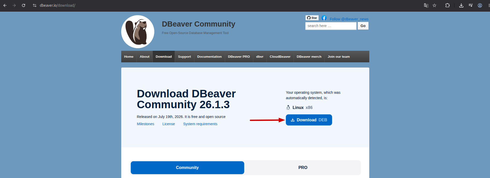
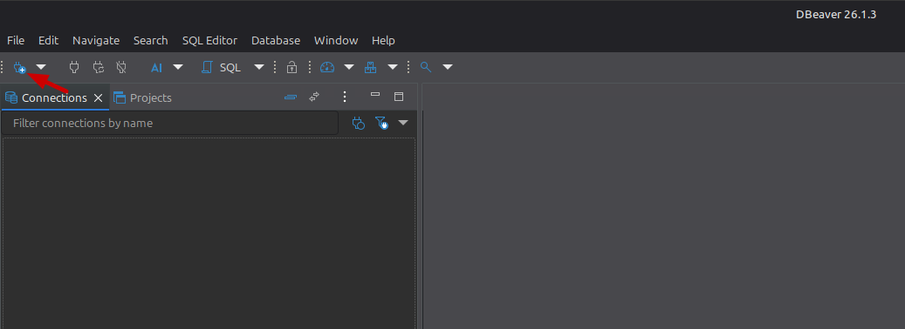
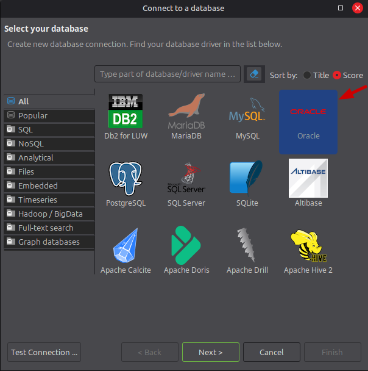
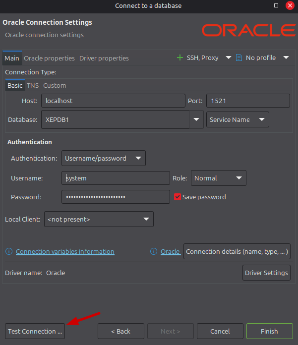
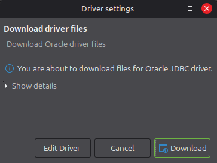
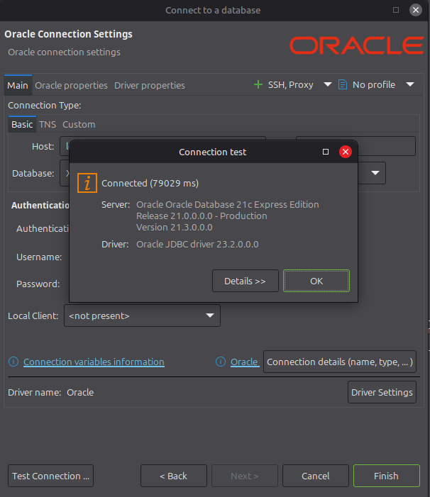
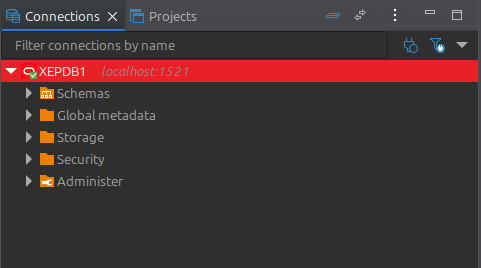
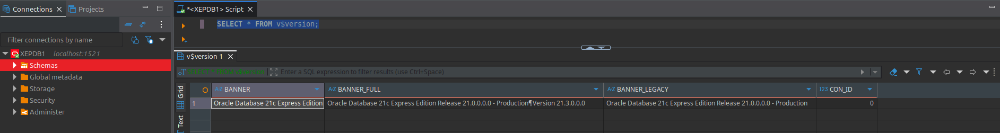
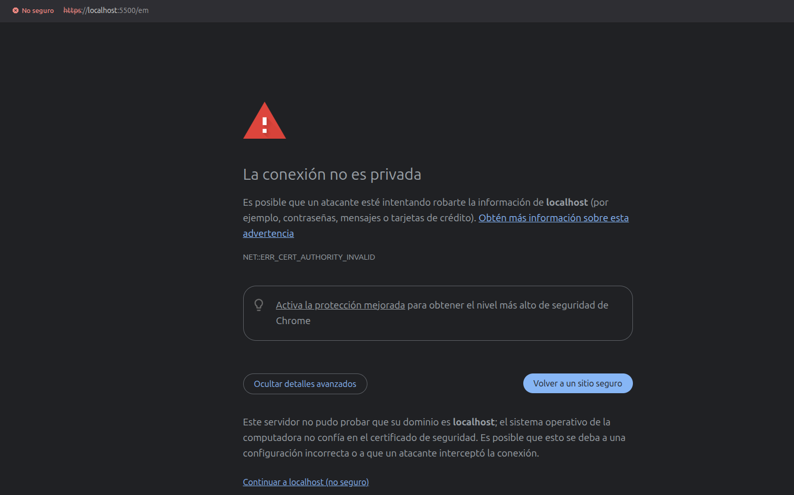
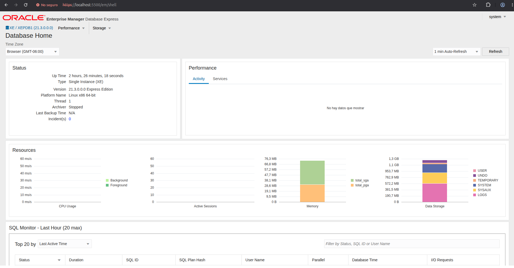

# Instalación de Oracle Database 21c en Docker

## Introducción

En esta guía se describen los pasos necesarios para instalar Oracle Database 21c Express Edition (XE) en un equipo con GNU/Linux utilizando Docker. El procedimiento se ha validado sobre Debian 13, aunque puede aplicarse, con mínimos ajustes, a otras distribuciones basadas en Debian o Ubuntu.

Dado que el objetivo es disponer de un entorno de desarrollo y pruebas, se utilizará la edición Oracle Database 21c Express Edition (XE), la cual ofrece las siguientes características:

- Gratuita para desarrollo, pruebas y aprendizaje, sin costes de licencia
- Integración con lenguajes de programación como Java, .NET, Python, Node.js, Go, PHP, C/C++ y muchos más
- Una base de datos con todas las funciones
- Hasta 12 GB de datos de usuario
- Hasta 2 GB de RAM de base de datos
- Hasta 2 hilos de CPU

Oracle Database 21c Express Edition (XE) puede instalarse de forma nativa en los siguientes sistemas operativos:

- Oracle Linux
- Distribución Linux compatible con Red Hat Enterprise Linux (RHEL)
- SUSE Linux Enterprise
- Microsoft Windows

Para una instalación nativa, Oracle recomienda contar con al menos 2 GB de memoria RAM y 10 GB de espacio libre en disco.

No obstante, también es posible ejecutar Oracle Database 21c XE en otras distribuciones de Linux mediante Docker. Este enfoque permite utilizar sistemas como Debian o Ubuntu sin necesidad de realizar una instalación nativa del software, simplificando la configuración del entorno y facilitando su despliegue. Este será el método utilizado a lo largo de esta guía.

[Fuente de información](https://www.oracle.com/database/technologies/appdev/xe.html)

## Requisitos
- Sistema GNU/Linux (Debian/Ubuntu)
- Acceso como administrador(root)
- Conexión a internet

## Instalación de Docker

De acuerdo a la documentación oficial de Docker, los pasos para instalar en Debian son los siguientes:

```bash
sudo apt update
sudo apt install ca-certificates curl
sudo install -m 0755 -d /etc/apt/keyrings
sudo curl -fsSL https://download.docker.com/linux/debian/gpg -o /etc/apt/keyrings/docker.asc
sudo chmod a+r /etc/apt/keyrings/docker.asc
```

Posteriormente agregar el repositorio en las fuentes
```bash
sudo tee /etc/apt/sources.list.d/docker.sources <<EOF
Types: deb
URIs: https://download.docker.com/linux/debian
Suites: $(. /etc/os-release && echo "$VERSION_CODENAME")
Components: stable
Architectures: $(dpkg --print-architecture)
Signed-By: /etc/apt/keyrings/docker.asc
EOF
```

Actualizamos los repositorios e instalamos

```bash
sudo apt update
sudo apt install docker-ce docker-ce-cli containerd.io docker-buildx-plugin docker-compose-plugin -y
```

El proceso tarda un par de minutos, dependiendo la velocidad de la red, al terminar verificamos el estado que debe indicar **active (running)**

```bash
sudo systemctl status docker
```

Si deseamos usar Docker sin usar sudo en Linux, debemos de agregar nuestro usuario al grupo de Docker para acceder sin tener permisos de administrador, esto lo realizamos mediante los siguientes comandos.

```bash
sudo usermod -aG docker $USER
newgrp docker
```

## Instalación de Oracle 21c en Docker Compose

Creamos el directorio donde se almacenarán los archivos de Docker y ajustamos los permisos de la carpeta.

```bash
sudo mkdir -p /opt/docker/oracle
sudo chown -R "$USER":"$USER" /opt/docker/oracle
```
Creamos el archivo de configuración de Docker Compose utilizando el siguiente comando

```bash
cd /opt/docker/oracle
nano docker-compose.yml
```

Colocamos el siguiente contenido:

```bash
services:
  oracle:
    image: container-registry.oracle.com/database/express:21.3.0-xe
    container_name: oracle21xe
    restart: unless-stopped
    ports:
      - "1521:1521"
      - "5500:5500"
    environment:
      ORACLE_PWD: "IngresarPasswordSegura_1"
    volumes:
      -  oracle21xe-data:/opt/oracle/oradata
volumes:
  oracle21xe-data:
```

Descargamos la imagen del contenedor, el proceso puede tardar algunos minutos.

```bash
docker compose pull
```

Iniciamos el contenedor de Oracle DB XE.

```bash
docker compose up -d
```

Una vez finalizado el proceso de creación del contenedor, espere unos segundos/minutos para que Oracle Database complete su inicialización. Si todo ha transcurrido correctamente, el contenedor de Docker estará en ejecución. Puede comprobar su estado con el siguiente comando:

```bash
docker ps
docker compose logs -f
```

## Conexión desde DBeaver

En este punto, Oracle Database 21c Express Edition (XE) ya se encuentra en ejecución y está listo para recibir conexiones.

Aunque **Oracle SQL Developer** es la herramienta oficial de Oracle para administrar la base de datos, su instalación nativa está orientada a Microsoft Windows y a distribuciones GNU/Linux basadas en RPM, como Oracle Linux, Red Hat Enterprise Linux (RHEL), Rocky Linux, AlmaLinux y Fedora.

En esta guía, al utilizar Debian/Ubuntu, usaremos **DBeaver Community**, un cliente de bases de datos multiplataforma compatible con Oracle Database, que ofrece una instalación sencilla y las funcionalidades necesarias para administrar la base de datos.

Vamos al sitio oficial https://dbeaver.io/download/ y descargamos la versión de Linux .deb



Instalamos desde comandos con apt de la siguiente manera.

```bash
sudo apt install ./dbeaver-ce-*.deb
```

Al terminar el proceso, podemos iniciarlo desde el menú de aplicaciones buscando **DBeaver**

Ahora vamos a conectarnos a Oracle XE 21c, para ello, dentro de DBeaver clic en **New Database Connection**



Seleccionamos la base de datos **Oracle** y clic en Next



En los datos de conexión, colocamos lo siguiente y clic en **Test Connection**:

- Host: localhost
- Port: 1521
- Database: XEPDB1
- Username: system
- Password: La configurada en ORACLE_PWD de docker-compose



Si es la primera vez que realizamos una conexión a una base de datos Oracle desde DBeaver, la aplicación solicitará descargar el controlador (driver JDBC) necesario para establecer la conexión, clic en Download y esperar a que termine el proceso.



Si los datos de conexión son correctos y la prueba se realiza correctamente, DBeaver mostrará el mensaje **Connected**. Clic en OK y, posteriormente, en Finish para finalizar la configuración de la conexión.



De esta manera, en la sección Conexiones de DBeaver, podremos observar la nueva conexión que acabamos de crear.



Podemos verificar que tenemos la versión correcta con el siguiente query:

```sql
SELECT * FROM v$version;
```



## Acceso desde Oracle Enterprise Manager Database Express

En la instalación de la versión 21c XE en Docker incluye Oracle Enterprise Manager Database Express (EM Express), en la sección de puertos de docker-compose se incluye lo siguiente:

```bash
ports:
    - "1521:1521"
    - "5500:5500"
```

Esto indica que el acceso a Oracle Enterprise Manager Database Express (EM Express) se realiza mediante el puerto 5500, para acceder ingresamos la siguiente URL desde un navegador: **https://localhost:5500/em**

Debido a que el servicio utiliza HTTPS, pero no cuenta con un certificado digital emitido por una autoridad certificadora reconocida, el navegador mostrará una advertencia indicando que la conexión no es privada.

En Google Chrome, seleccione Opciones avanzadas y posteriormente clic en **Continuar a localhost (no seguro)** para acceder a la interfaz de administración.



En el campo Username, ingresamos el usuario **system** y, en el campo de contraseña, usamos la clave definida en el archivo docker-compose, en Container Name ingresamos **XEPDB1**.
Si las credenciales proporcionadas son correctas, se iniciará sesión en Oracle Enterprise Manager Database Express (EM Express), desde donde podremos administrar la base de datos.



---
---

En este punto, **Oracle Database 21c Express Edition (XE)** ya se encuentra en ejecución y podemos establecer conexiones hacia la base de datos, ya sea mediante un cliente de administración como **DBeaver Community** o desde cualquiera de los entornos de desarrollo compatibles mencionados al inicio de esta guía.

## Referencias
https://www.debian.org/
https://docs.docker.com/engine/install/debian/
https://docs.oracle.com/en/database/oracle/oracle-database/21/xeinl/requirements.html
https://www.oracle.com/latam/database/technologies/appdev/xe.html
https://www.oracle.com/database/technologies/xe-downloads.html
https://container-registry.oracle.com/
https://dbeaver.io/
https://www.oracle.com/database/sqldeveloper/
