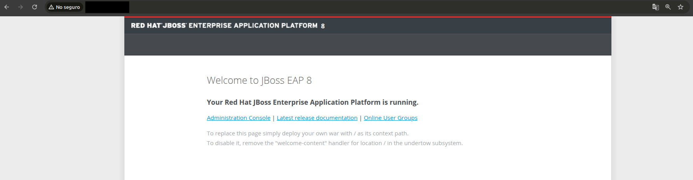
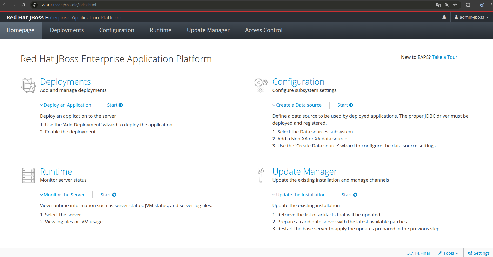

# Instalación y configuración de servidor JBoss EAP en Linux

En esta guía se describen los pasos necesarios para instalar y configurar el servidor de aplicaciones JBoss, ejecutándose desde un servidor GNU/Linux.

## Introducción

Red Hat JBoss Enterprise Application Platform (JBoss EAP) es un entorno de ejecución certificado para aplicaciones basadas en Java EE, se usa para ejecutar, implementar y administrar aplicaciones Java empresariales.

Ofrece opciones preconfiguradas para funciones como agrupamiento de alta disponibilidad, mensajería y almacenamiento en caché distribuido. También permite que los usuarios escriban, implementen y ejecuten aplicaciones mediante la diversidad de API y servicios que ofrece JBoss EAP.

[Fuente de información](https://docs.redhat.com/es/documentation/red_hat_jboss_enterprise_application_platform/7.1/html/introduction_to_jboss_eap/overview_of_jboss_eap)

## Requisitos

- Servidor GNU/Linux (sin interfaz gráfica)
  Para este ejemplo se usa **Debian 13** en una máquina virtual, pero también se puede instalar en un equipo físico (PC/Laptop) que se encuentre en la misma red
- Cliente para realizar las configuraciones
  Equipo con GNU/Linux, si vamos a ingresar desde equipo Windows podemos usar alguna herramienta como MobaXterm, WinSCP o PuTTY.
- Conexión a internet
- Para entornos de desarrollo y pruebas, como es este caso, Red Hat Enterprise Linux (RHEL) puede descargarse y utilizarse sin costo mediante una cuenta de Red Hat Developer. En entornos de producción, es necesario contar con una suscripción de Red Hat para acceder al soporte técnico y a las actualizaciones certificadas.

*Nota: Aunque Red Hat Enterprise Linux (RHEL) es la distribución oficialmente soportada para la instalación de JBoss EAP, este también puede instalarse y ejecutarse en cualquier distribución de Linux que disponga de Java JDK. Dado que este entorno está destinado a desarrollo y pruebas, la instalación se realizará sobre Debian. Para entornos de producción, se recomienda utilizar RHEL, ya que ofrece soporte oficial y acceso a actualizaciones certificadas.*

El objetivo de utilizar un servidor sin interfaz gráfica en esta guía es familiarizarte con la administración del sistema desde la línea de comandos. De esta forma, cuando decidas configurar servidores en la nube, como un Servidor Privado Virtual (VPS), ya estarás preparado para trabajar en el entorno habitual, donde el acceso normalmente se realiza mediante SSH y sin una interfaz gráfica.

## Configuración inicial de Debian 13

Ingresar al servidor mediante el siguiente comando, colocar la contraseña configurada en el proceso de instalación para el usuario creado.

```bash
ssh usuario@ip
```

Ingresar con privilegios de administración, colocar la contraseña configurada para el usuario root en el proceso de instalación.

```bash
su -
```

Actualizar el sistema e instalar las utilidades básicas.

```bash
apt update
apt upgrade
apt install sudo curl wget unzip pkg-config -y
```

Agregar el usuario al grupo de sudo mediante el siguiente comando, recordar cambiar "usuario" por el usuario que configuraste en la instalación de Debian.

```bash
usermod -aG sudo usuario
```

Para ver los cambios aplicados, vamos a salir del servidor e ingresar nuevamente.

```bash
exit
exit
ssh usuario@ip
```

Para comprobar que sudo funciona correctamente, podemos verificar que el siguiente comando no nos muestre error, nos va a solicitar la contraseña del usuario

```bash
sudo apt update
```

## Instalación de OpenJDK 21

Para este ejemplo, vamos a instalar OpenJDK en su versión 21 headless, ya que incluye el compilador y entorno de ejecución sin las bibliotecas de interfaz gráfica de usuario, al estar utilizando un servidor Debian 13 sin interfaz, esta opción es mejor.

Ingresar a la terminal y escribir los siguientes comandos.

```bash
sudo apt update
sudo apt install openjdk-21-jdk-headless -y
```

Verificar que se instalo correctamente, la salida debería de mostrar algo como: openjdk version "21.x.x"

```bash
java -version
```

## Creación del usuario para JBoss

Por seguridad, no debemos de ejecutar el servicio como root, por ello, vamos a crear un usuario para este servidor mediante los siguientes comandos.

```bash
sudo groupadd --system jboss
sudo useradd --system --gid jboss --home-dir /opt/jboss-eap --shell /usr/sbin/nologin jboss
```

Con estos comandos realizamos lo siguiente:
- Se crea el grupo del sistema de nombre jboss
- Se crea un usuario del sistema, se indica que pertenece al grupo jboss, su directorio es /opt/jboss-eap y se indica que no puede iniciar sesión de forma interactiva

## Instalación de JBoss

Ir al sitio oficial de RedHat https://developers.redhat.com/products/eap/download, buscar la versión 8.1 para este caso y descargar el **Zip File**, en este proceso se requiere iniciar sesión con una cuenta de Red Hat Developer.

Este proceso lo realizamos desde nuestro equipo cliente, ya que al requerir autenticación es mas sencillo realizarlo desde el navegador, al terminar de descargar pasamos el archivo mediante ssh al servidor con el siguiente comando.

```bash
scp jboss-eap-8.1.0-dev.zip usuario@ip:/home/usuario
```

Ingresar nuevamente al servidor y crear la carpeta que definimos al momento de crear el usuario de jboss

```bash
sudo mkdir -p /opt/jboss-eap
```

Extraer el archivo zip

```bash
unzip jboss-eap-8.1.0-dev.zip
```

Renombramos la carpeta a jboss-eap y la movemos al directorio de /opt

```bash
mv jboss-eap-8.1 jboss-eap
sudo mv jboss-eap/* /opt/jboss-eap
```

Asignamos el propietario de la carpeta con el usuario creado

```bash
sudo chown -R jboss:jboss /opt/jboss-eap
```

Definimos temporalmente las variables de entorno de JDK y JBoss

```bash
export JAVA_HOME=/usr/lib/jvm/java-21-openjdk-amd64
export EAP_HOME=/opt/jboss-eap
```

En versión 8.1, JBoss EAP incluye un generador de unidades systemd que facilita la creación del servicio. Para utilizarlo, accedemos al siguiente directorio:

```bash
cd /opt/jboss-eap/bin/systemd
```

Generamos el servicio con el siguiente comando. En este ejemplo se asume que el usuario es jboss, tal como se indicó en los pasos anteriores. Si utilizas un usuario y grupo diferente, cambia el valor correspondiente en el comando.

```bash
sudo bash ./generate_systemd_unit.sh -m standalone -u jboss -g jboss
```

Nos va a solicitar confirmación para crear el archivo, escribimos **y** y enter

```bash
Do you want to generate /opt/jboss-eap/bin/systemd/jboss-eap-standalone.service? (y/n): y
```

Al terminar el proceso correctamente se muestra el siguiente mensaje: *INFO: systemd unit file generated.*, ejecutar los siguientes comandos para continuar con la instalación del servicio.

Editamos uno de los archivos generados para definir las variables de entorno y las rutas utilizadas por JBoss EAP.

```bash
sudo nano /opt/jboss-eap/bin/systemd/jboss-eap-standalone.conf
```

Para nuestro caso, lo dejamos de la siguiente manera

```bash
JAVA_HOME=/usr/lib/jvm/java-21-openjdk-amd64
JBOSS_EAP_SH="/opt/jboss-eap/bin/standalone.sh"
JBOSS_EAP_SERVER_CONFIG=standalone.xml
JBOSS_EAP_BIND=127.0.0.1
JBOSS_EAP_OPTS=""
```

Para crear el servicio, vamos a copiar los archivos generados y configurados en el paso anterior de la siguiente manera.


```bash
sudo cp /opt/jboss-eap/bin/systemd/jboss-eap-standalone.service /etc/systemd/system/
sudo cp /opt/jboss-eap/bin/systemd/jboss-eap-standalone.conf /etc/default/jboss-eap-standalone.conf
```

Editamos el archivo del servicio, en la parte de EnvironmentFile lo vamos a dejar de la siguiente manera.

```bash
sudo nano /etc/systemd/system/jboss-eap-standalone.service

EnvironmentFile=-/etc/default/jboss-eap-standalone.conf
```

Recargamos systemd, habilitamos el servicio y lo iniciamos

```bash
sudo systemctl daemon-reload
sudo systemctl enable jboss-eap-standalone.service
sudo systemctl start jboss-eap-standalone.service
```

Verificamos que se este ejecutando correctamente con el siguiente comando, si todo es correcto, se debe mostrar con **active (running)**

```bash
sudo systemctl status jboss-eap-standalone.service
```

Para revisar los logs en tiempo real usamos el siguiente comando, para salir presionamos ctrl + c

```bash
sudo tail -f /opt/jboss-eap/standalone/log/server.log
```

## Creación de usuario administrativo

Llamar al script oficial para crear el usuario mediante el comando:

```bash
sudo -u jboss /opt/jboss-eap/bin/add-user.sh
```

En las opciones que se muestra, seleccionar **a**, que es el usuario administrador
Ingresamos las credenciales, por ejemplo:
username: admin-jboss
password: Admin-jboss1
En grupos lo dejamos en blanco y presionamos enter
Cuando nos pregunta: Is this correct yes/no?, escribimos yes y luego presionamos enter

## Configurar la integración con Nginx

Instalamos de nginx mediante los siguientes comandos en caso de no tenerlo instalado previamente.

```bash
sudo apt update
sudo apt install -y nginx
sudo systemctl enable nginx
```

Vamos a crear el nuevo sitio para jboss con el comando.

```bash
sudo nano /etc/nginx/sites-available/jboss-eap
```

Ingresamos el siguiente contenido para una configuración básica, pero se puede extender de acuerdo a las configuraciones necesarias de cada ambiente/servidor.

```bash
server {
    listen 80;
    listen [::]:80;

    server_name _;

    location / {
        proxy_pass http://127.0.0.1:8080;

        proxy_set_header Host $host;
        proxy_set_header X-Real-IP $remote_addr;
        proxy_set_header X-Forwarded-For $proxy_add_x_forwarded_for;
        proxy_set_header X-Forwarded-Proto $scheme;

        proxy_connect_timeout 5s;
        proxy_read_timeout 60s;
        proxy_send_timeout 60s;
    }
}
```

Eliminamos el sitio por default, activamos el nuevo sitio creado, posteriormente reiniciamos y verificamos que este funcionando de manera correcta.

```bash
sudo rm -f /etc/nginx/sites-enabled/default
sudo ln -sfn /etc/nginx/sites-available/jboss-eap /etc/nginx/sites-enabled/jboss-eap
sudo systemctl reload nginx
sudo systemctl status nginx 
```

Desde un equipo cliente, accedemos a la dirección IP del servidor configurado. Si la instalación y la configuración se realizaron correctamente, se mostrará la página de inicio de JBoss EAP.



Hasta este punto, contamos con la siguiente configuración:

Cliente en la misma red
  | puerto 80 por default
Nginx
  | 127.0.0.1:8080
JBoss

## Acceso a la consola de administración

En este punto nos encontramos con una limitación de acceso, la consola de administración usa por defecto el puerto 9990, mientras que en nuestra configuración únicamente hemos publicado el puerto 80, que redirige al 8080 del servidor.

Desde el punto de vista de seguridad, lo recomendable es no exponer el puerto de administración en la red/internet. Lo ideal es que solo los administradores autorizados puedan acceder a él. Una forma sencilla y segura de conseguirlo es mediante un túnel SSH.

En el equipo cliente GNU/Linux abrimos la terminal y escribimos el siguiente comando:

```bash
ssh -L 9990:127.0.0.1:9990 usuario@ip
```

Este comando crea un túnel que redirige el puerto local 9990 al puerto 9990 del servidor remoto. De este modo, la consola de administración puede abrirse desde el navegador accediendo a http://127.0.0.1:9990, sin necesidad de exponer dicho puerto públicamente.

Para establecer el túnel es necesario disponer de las credenciales de acceso por SSH del servidor. En consecuencia, el acceso al panel de administración queda protegido por la autenticación de SSH, lo que añade una capa adicional de seguridad al evitar que la interfaz administrativa sea accesible directamente desde la red.



De esta manera se ha realizado las siguientes configuraciones:
- Ajustes iniciales en Debian 13
- Instalación y configuración de JBoss EAP 8.1
- Instalación y configuración de Nginx
- Acceso a consola de administración de JBoss de manera segura por túnel SSH
- Configuraciones realizadas por medio de línea de comandos de Linux

## Referencias
https://www.redhat.com/en/technologies/jboss-middleware/application-platform
https://nginx.org/

