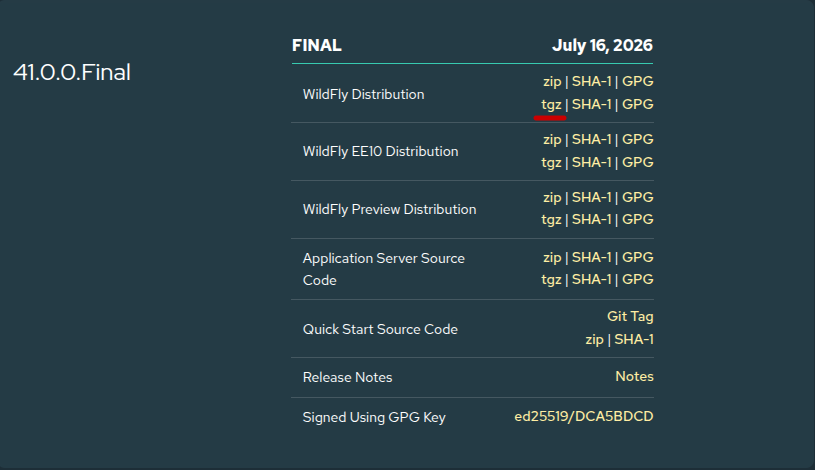
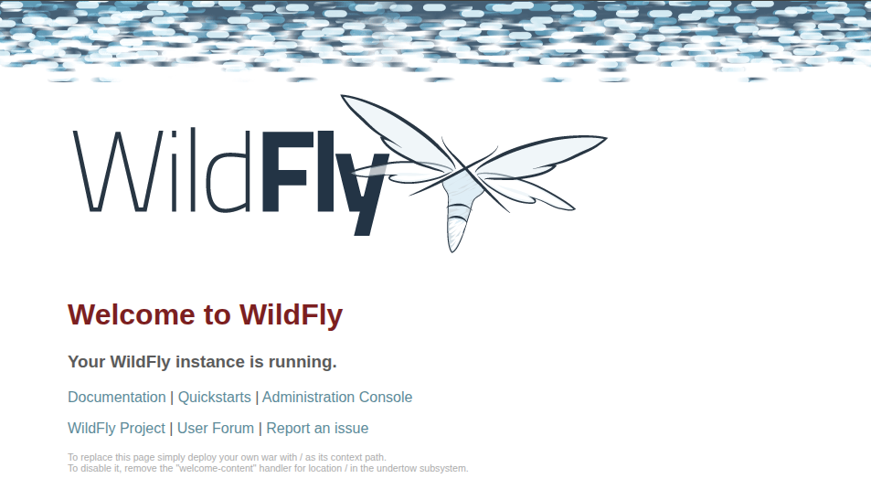
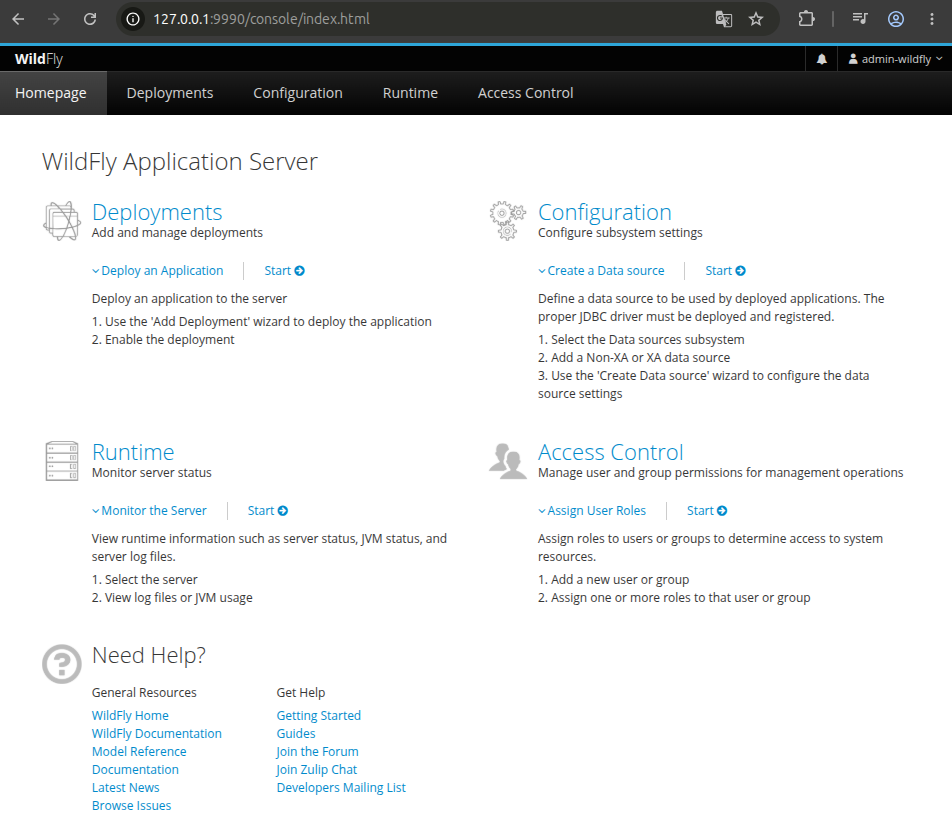

# Instalación y configuración de servidor WildFly en Linux

En esta guía se describen los pasos necesarios para instalar y configurar el servidor de aplicaciones WildFly, ejecutándose desde un servidor GNU/Linux.

## Introducción

WildFly es un entorno de ejecución de aplicaciones gestionado, flexible y ligero usado para aplicaciones web Java.

Existe una relación de WildFly y JBoss EAP, que de manera resumida, se puede comentar lo siguiente:
JBoss EAP es el servidor de aplicaciones comercial con certificación Jakarta-EE para el cual Red Hat ofrece soporte comercial. JBoss EAP es una versión comercial del proyecto Wildfly. 

WildFly es completamente abierto. Todos sus componentes son de código abierto y siguen un proceso de desarrollo centrado en la comunidad.

Mientras que WildFly prioriza la innovación y la adopción temprana de nuevas tecnologías, JBoss EAP prioriza la estabilidad, el soporte y la confiabilidad para entornos empresariales.

[Fuente de información](https://www.theserverside.com/blog/Coffee-Talk-Java-News-Stories-and-Opinions/WildFly-vs-JBoss-EAP-How-these-Red-Hat-application-servers-differ)

## Requisitos

- Servidor GNU/Linux (sin interfaz gráfica)
  Para este ejemplo se usa **Debian 13** en una máquina virtual, pero también se puede instalar en un equipo físico (PC/Laptop) que se encuentre en la misma red
- Cliente para realizar las configuraciones
  Equipo con GNU/Linux, si vamos a ingresar desde equipo Windows podemos usar alguna herramienta como MobaXterm, WinSCP o PuTTY.
- Conexión a internet

El objetivo de utilizar un servidor sin interfaz gráfica en esta guía es familiarizarte con la administración del sistema desde la línea de comandos. De esta forma, cuando decidas configurar servidores en la nube, como un Servidor Privado Virtual (VPS), ya estarás preparado para trabajar en el entorno habitual, donde el acceso normalmente se realiza mediante SSH y sin una interfaz gráfica.

## Proceso de instalación/configuración

## Configuración inicial de Debian 13

Ingresar al servidor mediante el siguiente comando desde la línea de comandos, colocar la contraseña configurada en el proceso de instalación para el usuario creado.

```bash
ssh usuario@ip
```

Ingresar con privilegios de administración, colocar la contraseña configurada para el usuario root en el proceso de instalación

```bash
su -
```

Actualizar el sistema e instalar las utilidades básicas

```bash
apt update
apt upgrade
apt install sudo curl wget unzip -y
```

Agregar el usuario al grupo de sudo mediante el siguiente comando, recordar cambiar "usuario" por el usuario que configuraste en la instalación de Debian.

```bash
usermod -aG sudo usuario
```

Para ver los cambios aplicados, vamos a salir del servidor e ingresar nuevamente.

```bash
exit
exit
ssh usuario@ip
```

Para comprobar que sudo funciona correctamente, podemos verificar que el siguiente comando no nos muestre error, nos va a solicitar la contraseña del usuario

```bash
sudo apt update
```

## Instalación de OpenJDK 21

Para este ejemplo, vamos a instalar OpenJDK en su versión 21 headless, ya que incluye el compilador y entorno de ejecución sin las bibliotecas de interfaz gráfica de usuario, al estar utilizando un servidor Debian 13 sin interfaz, esta opción es mejor.

Ingresar a la terminal y escribir los siguientes comandos

```bash
sudo apt update
sudo apt install openjdk-21-jdk-headless -y
```

Verificar que se instalo correctamente, la salida debería de mostrar algo como: openjdk version "21.x.x"

```bash
java -version
```

## Creación del usuario para WildFly

Por seguridad, no debemos de ejecutar el servicio como root, por ello, vamos a crear un usuario para este servidor mediante los siguientes comandos.

```bash
sudo groupadd --system wildfly
sudo useradd --system --gid wildfly --home-dir /opt/wildfly --shell /usr/sbin/nologin wildfly
```

Con estos comandos realizamos lo siguiente:
- Se crea el grupo del sistema de nombre wildfly
- Se crea un usuario del sistema, se indica que pertenece al grupo wildfly, su directorio es /opt/wildfly y se indica que no puede iniciar sesión de forma interactiva

## Instalación de WildFly

Ir al sitio oficial para realizar la descarga https://www.wildfly.org/downloads/

Seleccionar la última versión que sea **Final**, no seleccionar las versiones Beta, a la fecha la última versión final es la 41.0.0.Final
Clic derecho sobre tgz y copiar dirección de enlace.



Realizar el siguiente comando para descargar directo en el servidor

```bash
wget https://github.com/wildfly/wildfly/releases/download/41.0.0.Final/wildfly-41.0.0.Final.tar.gz
```

Descomprimir con el comando

```bash
tar -xzf wildfly-41.0.0.Final.tar.gz
```

Cambiamos el nombre de la carpeta para que sea mas corto con el siguiente comando

```bash
mv wildfly-41.0.0.Final wildfly
```

Movemos la carpeta en el directorio /opt con el comando

```bash
sudo mv wildfly /opt/wildfly
```

Asignamos el propietario de la carpeta

```bash
sudo chown -R wildfly:wildfly /opt/wildfly
```

## Crear servicio

Para ejecutar como servicio realizamos las siguientes configuraciones con los archivos oficiales que vienen en la instalación del servidor WildFly.

```bash
sudo mkdir -p /etc/wildfly
sudo cp /opt/wildfly/docs/contrib/scripts/systemd/wildfly.service /etc/systemd/system/
sudo cp /opt/wildfly/docs/contrib/scripts/systemd/wildfly.conf /etc/wildfly
sudo cp /opt/wildfly/docs/contrib/scripts/systemd/launch.sh /opt/wildfly/bin/
sudo chmod +x /opt/wildfly/bin/launch.sh
```

Una vez que tenemos los archivos oficiales en los directorios correspondientes, vamos a configurar.

```bash
sudo nano /etc/wildfly/wildfly.conf
```
Para este ejemplo, no vamos a exponer directamente wildfly desde la red, sino que se realizara mediante un proxy inverso con Nginx, por ello, en la parte de WILDFLY_BIND=0.0.0.0, lo vamos a cambiar por:

```bash
WILDFLY_BIND=127.0.0.1
```
Al estar usando nano, guardamos con ctrl + o y cerramos con ctrl + x

Recargamos los scripts del sistema e iniciamos el servidor.

```bash
sudo systemctl daemon-reload
sudo systemctl start wildfly
```

Podemos ver el estado con el siguiente comando, debería de mostrar : **active (running)**

```bash
sudo systemctl status wildfly
```

Como es un servidor dedicado a aplicaciones, es conveniente habilitar que se inicie automáticamente al iniciar el sistema.

```bash
sudo systemctl enable wildfly
```

Podemos revisar los logs del servidor mediante el comando, para terminar ctrl + c

```bash
tail -f /opt/wildfly/standalone/log/server.log
```

De esta manera ya tenemos funcionando el servidor, pero como nuestro objetivo es acceder con Nginx y que Wildfly no exponga los puertos en la red, continuamos con las siguientes configuraciones.

## Configurar para integración con Nginx

Modificar el archivo de servicio para que funcione correctamente con Nginx, para ello vamos a editarlo con el siguiente comando:

```bash
sudo nano /etc/systemd/system/wildfly.service
```

Cambiamos el inicio del archivo, quedando de la siguiente manera:

```bash
[Unit]
Description=The WildFly Application Server
After=network-online.target       
Wants=network-online.target
Before=nginx.service
```

En la parte de Service, después de user agregamos lo siguiente:

```bash
Group=wildfly
RuntimeDirectory=wildfly
RuntimeDirectoryMode=0755
```

Eliminamos la linea:

```bash
StandardOutput=null
```

Guardamos con ctrl + o y cerramos con ctrl + x

Aplicamos los cambios realizados con los siguientes comandos:

```bash
sudo systemctl daemon-reload
sudo systemctl enable wildfly
sudo systemctl restart wildfly
```

El siguiente paso es instalar de nginx mediante los siguientes comandos

```bash
sudo apt update
sudo apt install -y nginx
sudo systemctl enable nginx
```

Creación del archivo de configuración

```bash
sudo nano /etc/nginx/sites-available/wildfly
```

Ingresar las siguientes configuraciones, lo cual escuchara las solicitudes en el puerto 80 y redirecciona hacia el 8080 de wildfly sin exponer directamente 8080 en la red.

```bash
server {
    listen 80;
    listen [::]:80;

    server_name _;

    location / {
        proxy_pass http://127.0.0.1:8080;

        proxy_set_header Host $host;
        proxy_set_header X-Real-IP $remote_addr;
        proxy_set_header X-Forwarded-For $proxy_add_x_forwarded_for;
        proxy_set_header X-Forwarded-Proto $scheme;
    }
}

```

Eliminamos el sitio por default, activamos el nuevo sitio creando con el siguiente comando, posteriormente reiniciamos y verificamos que este funcionando bien.

```bash
sudo rm -f /etc/nginx/sites-enabled/default
sudo ln -s /etc/nginx/sites-available/wildfly /etc/nginx/sites-enabled/wildfly
sudo systemctl restart nginx
sudo systemctl status nginx 
```

Si toda la configuración es correcta, podemos acceder desde cualquier equipo en la misma red a la IP del servidor y observar algo como lo siguiente:



Hasta este punto, contamos con la siguiente configuración:

Cliente en la misma red
  | puerto 80 por default
Nginx
  | 127.0.0.1:8080
WildFly

## Creación de usuario administrativo

Llamar al script oficial para crear el usuario mediante el comando:

```bash
sudo -u wildfly /opt/wildfly/bin/add-user.sh
```

En las opciones que se muestra, seleccionar a, que es el usuario administrador
Ingresamos las credenciales, por ejemplo:
username: admin-wildfly
password: Admin-wildfly1
En grupos lo dejamos en blanco y presionamos enter
Cuando nos pregunta: Is this correct yes/no?, escribimos yes y luego presionamos enter

En este punto nos encontramos con una limitación de acceso, la consola de administración usa por defecto el puerto 9990,mientras que en nuestra configuración únicamente hemos publicado el puerto 80, que redirige al 8080 del servidor.

Desde el punto de vista de seguridad, lo recomendable es no exponer el puerto de administración en la red/internet. Lo ideal es que solo los administradores autorizados puedan acceder a él. Una forma sencilla y segura de conseguirlo es mediante un túnel SSH.

En el equipo cliente GNU/Linux abrimos la terminal y escribimos el siguiente comando:

```bash
ssh -L 9990:127.0.0.1:9990 usuario@ip
```

Este comando crea un túnel que redirige el puerto local 9990 al puerto 9990 del servidor remoto. De este modo, la consola de administración puede abrirse desde el navegador accediendo a http://127.0.0.1:9990, sin necesidad de exponer dicho puerto públicamente.

Para establecer el túnel es necesario disponer de las credenciales de acceso por SSH del servidor. En consecuencia, el acceso al panel de administración queda protegido por la autenticación de SSH, lo que añade una capa adicional de seguridad al evitar que la interfaz administrativa sea accesible directamente desde la red.



De esta manera se ha realizado las siguientes configuraciones:
- Ajustes iniciales en Debian 13
- Instalación y configuración de Wildfly
- Instalación y configuración de Nginx
- Acceso a consola de administración de Wildfly de manera segura por túnel SSH
- Configuraciones realizadas por medio de línea de comandos de Linux

En guías posteriores se muestra la configuración de datasource y los pasos para desplegar aplicaciones en Wildfly.

## Referencias
https://www.wildfly.org/
https://nginx.org/
