# Entorno Desarrollo Spring Boot en Linux Mint

En esta guía se muestran las configuraciones para desarrollo de Spring Boot en un sistema Linux Mint 22

## Requerimientos
- Sistema Linux Mint (O derivados de Ubuntu)
- Acceso a terminal como root

## Software a instalar
- Git
- Visual Studio Code
- Java Open JDK 21
- Apache Maven
- IntelliJ IDEA Community Edition
- Postman
- DBeaver

### Instalación de Git

Instalación de Git para realizar un control de versiones adecuado del código que se va a desarrollar con Spring Boot.

```bash
$ sudo apt install git
```

Comprobar que esta instalado

```bash
$ git --version

git version 2.43.0
```

Configurar usuario y correo de git

```bash
$ git config --global user.name "User"
$ git config --global user.email email
```

### Visual Studio Code

Descargar el paquete .deb desde el sitio web [VSCode](https://code.visualstudio.com/)

Abrir una terminal donde se encuentre el .deb y escribir el siguiente comando

```bash
$ sudo dpkg -i code_1.96.x_amd64.deb
```

Abrir VSCode, ir a la sección de Extensiones e instalar las que se requieran.
Como recomendación usar **Git Graph** para ver gráficamente el histórico de un repositorio y otras opciones que nos ofrece.

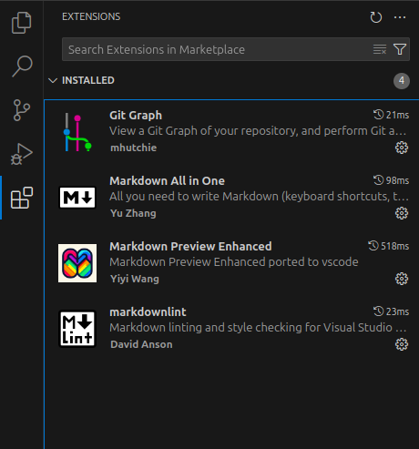

### OpenJDK

Descargar el JDK, 17 y 21 para este ejemplo desde la URL [Java JDK](https://jdk.java.net/archive/)

Seleccionar Linux/x64 y guardar

Seleccionar una carpeta en donde descomprimir los JDK, clic derecho y luego extraer aqui.

Mas adelante seleccionaremos el JDK deseado desde IntelliJ IDEA


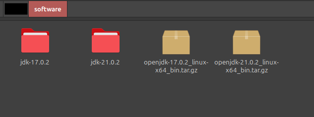


### Configurar variable de entorno JAVA_HOME
Abrir una terminal en el directorio principal y editar el archivo .profile

```bash
$ nano /home/[usuario]/.profile
```
Al final del archivo agregar las siguientes lineas


```bash
JAVA_HOME='/home/[usuario]/software/jdk-21.0.2'
PATH="$JAVA_HOME/bin:$PATH"
export PATH
```

Ejecutar el siguiente comando para que se apliquen los cambios


```bash
$ source .profile
```

Comprobar la versión instalada mediante el siguiente comando

```bash
$ java --version
openjdk 21.0.2 2024-01-16
OpenJDK Runtime Environment (build 21.0.2+13-58)
OpenJDK 64-Bit Server VM (build 21.0.2+13-58, mixed mode, sharing)
```

### Instalar Apache Maven

Descargar Apache Maven desde la url [Apache Maven](https://maven.apache.org/download.cgi), para este caso la versión apache-maven-3.9.9-bin.tar.gz

Abrir una terminal e ir al directorio donde se encuentra el archivo
```bash
$ cd /home/[usuario]/software/
$ tar -xvf apache-maven-3.9.9-bin.tar.gz
```

Configurar la variable de entorno M2_HOME

```bash
$ nano /home/[usuario]/.profile
```
Al final del archivo agregar las siguientes lineas

```bash
M2_HOME='/home/[usuario]/software/apache-maven-3.9.9'
PATH="$M2_HOME/bin:$PATH"
export PATH
```

Ejecutar el siguiente comando para que se apliquen los cambios


```bash
$ source .profile
```
Comprobar la versión instalada mediante el siguiente comando

```bash
$ mvn -version
Apache Maven 3.9.9 ()
Maven home: /home/[usuario]/software/apache-maven-3.9.9
Java version: 21.0.2, vendor: Oracle Corporation, runtime: /home/[usuario]/software/jdk-21.0.2
Default locale: es_MX, platform encoding: UTF-8
OS name: "linux", version: "6.8.0-51-generic", arch: "amd64", family: "unix"
```

*Nota: Si al abrir otra terminal aparte y ejecutar el comando mvn -version no se muestra, reiniciar el equipo para que se apliquen los cambios.*


### Instalar IntelliJ IDEA Community Edition
Descargar IntelliJ IDEA Community Edition desde la url [IntelliJ IDEA](https://www.jetbrains.com/idea/download/?section=linux)

Abrir una terminal en el directorio donde se encuentra descargado el archivo y descomprimir mediante el comando

```bash
$ cd /home/[usuario]/software/
$ tar -xvf ideaIC-2024.3.1.1.tar.gz
```
Para lanzar el IDE, ir a la carpeta que se genero al descomprimir el archivo > bin y dar doble clic en idea

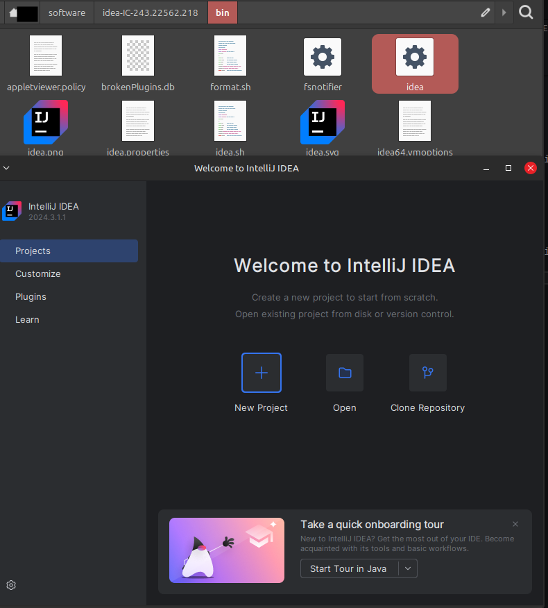

Se puede abrir siempre de esta manera, pero si se desea crear un lanzador para simplificar el proceso, dar clic en el icono de Engranaje > Create Desktop Entry

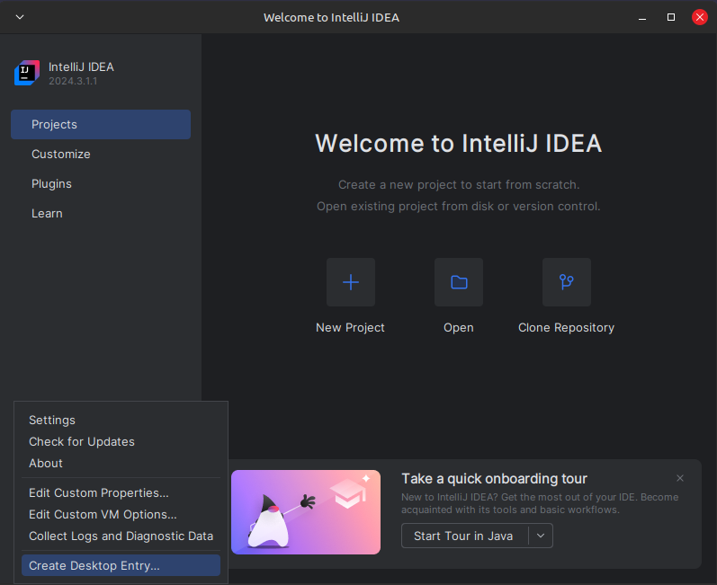

En la ventana de confirmación, clic en ok

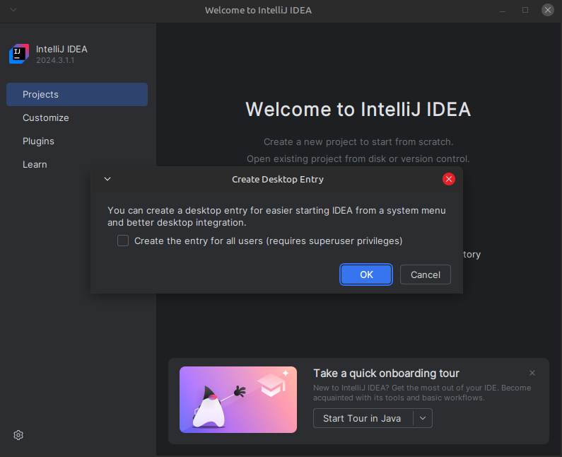

Si todo es correcto, se muestra un mensaje confirmando la acción

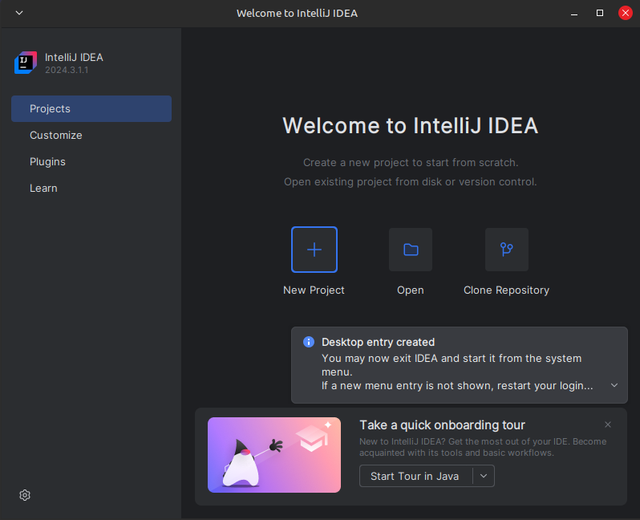

Una vez realizado estos pasos, podemos ir al menú de aplicaciones del sistema (En este caso Linux Mint), buscar IntelliJ y dar clic para lanzar el IDE.

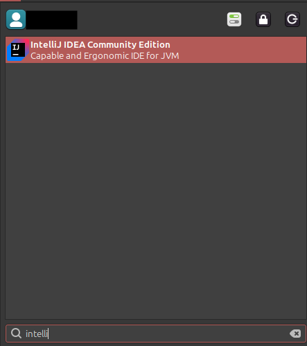

### Instalación de Postman
Descargar Postman desde la url [Postman](https://www.postman.com/downloads/), para este caso, Linux(x64)

Abrir una terminal en la ruta donde se descargo y descomprimir mediante el comando

```bash
$ cd /home/[usuario]/software/
$ tar -xvf postman-linux-x64.tar.gz
```

Crear el lanzador mediante el comando

```bash
cd ~/.local/share/applications/
nano Postman.desktop
```

En el nuevo archivo, agregar lo siguiente

```bash
[Desktop Entry]
Encoding=UTF-8
Name=Postman
Exec=/home/[usuario]/software/Postman/Postman %U
Icon=/home/[usuario]/software/Postman/app/icons/icon_128x128.png
Terminal=false
Type=Application
Categories=Development;
```
En el editor nano presionar Ctrl + o y enter para guardar, Ctrl + x para salir

Si todo es correcto, podemos ir al menú de aplicaciones del sistema, buscar Postman y dar clic para lanzar la aplicación.

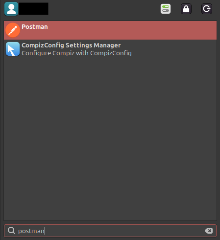


### Instalar DBeaver Community
Descargar la herramienta desde la URL [DBeaver](https://dbeaver.io/download/)

Seleccionar Linux Debian package (installer)

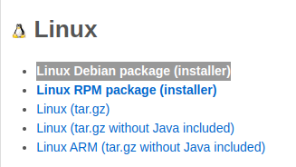

Abrir una terminal en la ruta donde se descargo el archivo .deb y realizar el siguiente comando

```bash
$ sudo dpkg -i dbeaver-ce_24.3.2_amd64.deb
```

Al terminar el proceso, podemos abrir la app desde el menú de aplicaciones del sistema


## Crear Aplicación Spring Boot 3

Para comprobar que todo esta funcionando correctamente, vamos a crear una aplicación de ejemplo con Spring Boot 3

Ir a la siguiente URL [Spring initializr](https://start.spring.io/)

Seleccionar los siguientes parámetros
- Project: Maven
- Language: Java
- Spring Boot: 3.4.1 (O la versión mas reciente estable)
- Project Metadata (Datos del proyecto)
- Packaging: Jar
- Java: 21

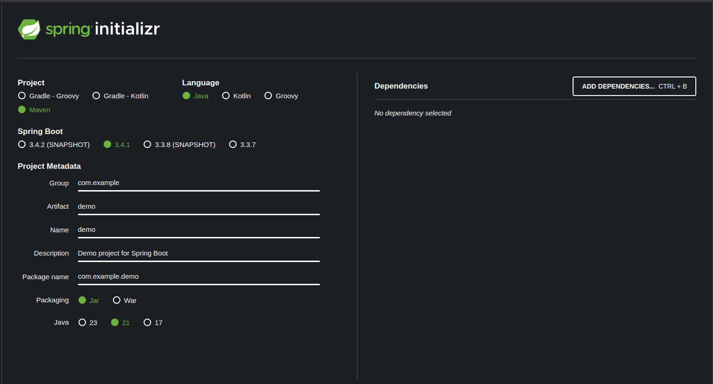

En la sección de dependencias, clic en Add Dependencies
Buscar y seleccionar las siguientes:
- Spring Web (Creación de APIS)
- Spring Data JPA (Consultas a BD)
- MySQL Driver

*Nota: Este es un ejemplo, agregar las necesarias para tu proyecto* 

Una vez seleccionadas las dependencias, clic en la parte inferior en el botón de Generate

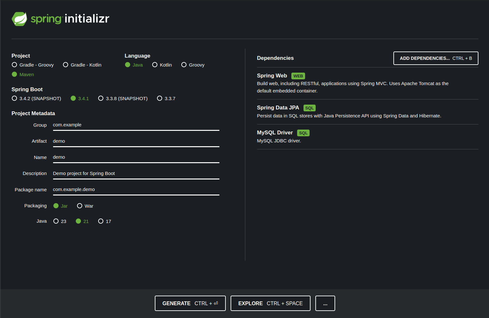

Descargar el archivo, descomprimir y colocar en el directorio deseado para almacenar los proyectos

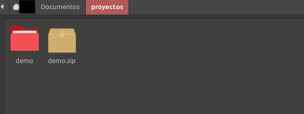

Abrir IntelliJ IntelliJ IDEA, clic en Open, buscar la carpeta donde se encuentra el proyecto y seleccionarla, clic en ok

En el mensaje de Trust and Open Project'demo clic en Trust Project

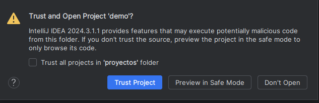


Nuestro proyecto de ejemplo se abre en el editor y lo podemos visualizar de la siguiente manera

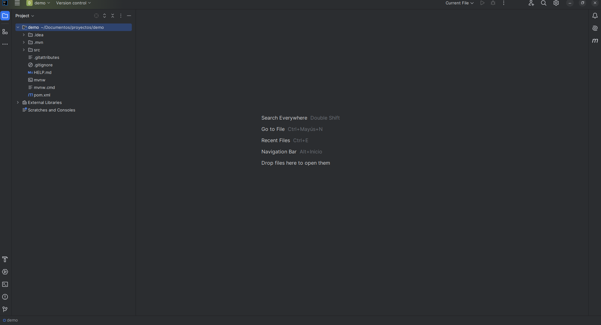


Para configurar el JDK, abrir File > Project Structure > SDKs
Revisar que este seleccionado el JDK 21 que descargamos, en caso contrario, seleccionar la carpeta.

Ir a Project > SDK y seleccionar de la lista OpenJDK 21, clic en ok

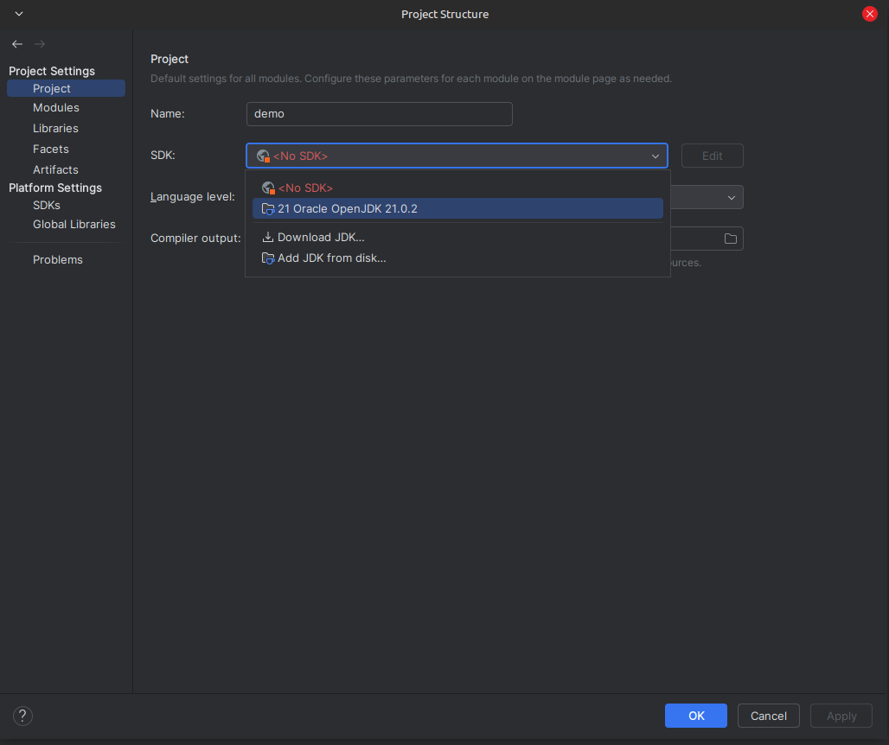


En el arbol del proyecto, ir a src > main > java > com.example.demo > Demo Application

Para que no marque un error al intentar ejecutar por falta de configuración de la base de datos, agregamos *(exclude = {DataSourceAutoConfiguration.class })* en la clase principal, quedando de la siguiente manera

```java
@SpringBootApplication(exclude = {DataSourceAutoConfiguration.class })
public class DemoApplication {

	public static void main(String[] args) {
		SpringApplication.run(DemoApplication.class, args);
	}

}
```

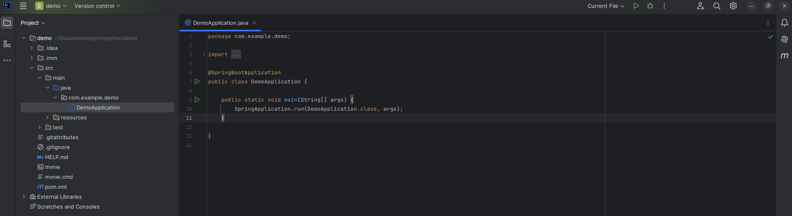

En la parte superior derecha dar clic en el icono de play

Si todo es correcto, en la consola nos indica que la aplicación se esta ejecutando mediante Tomcat en el puerto 8080

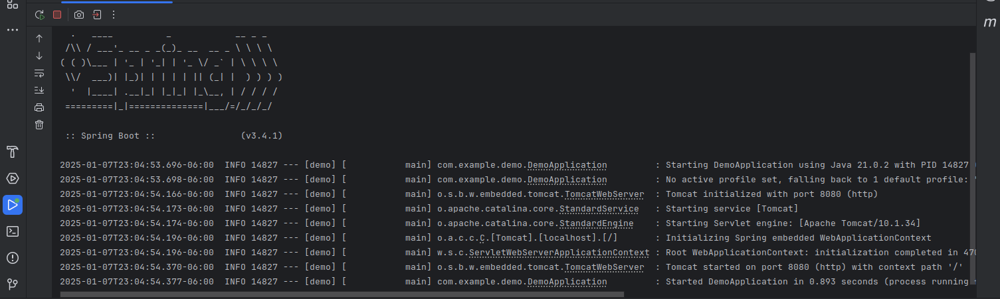


De esta manera configuramos nuestro entorno en Linux Mint para desarrollar en Spring Boot.

Para crear un servidor de base de datos lo podemos realizar mediante Docker con la siguiente guía
[Instalación de MariaDB en Docker](../docker/dockerMariaDB.md)


## Referencias 
https://git-scm.com/
https://code.visualstudio.com/
https://www.jetbrains.com/idea/
https://maven.apache.org/
https://www.postman.com/
https://dbeaver.io/

