# Configuración para deploy de aplicación Java en servidor JBoss en Linux

En esta guía se describen los pasos necesarios para realizar el despliegue de una aplicación desarrollada con Jakarta EE 10, configurada para conectarse a una base de datos PostgreSQL mediante un Datasource administrado por el servidor JBoss.

## Introducción

En este ejercicio realizaremos el despliegue de una aplicación desarrollada con Jakarta EE 10 y Java 21.
Es una API REST sencilla que tiene conexión a base de datos de PostgreSQL.
Al finalizar el proceso vamos a tener la siguiente configuración:
- Servidor Debian 13
  - JBoss en el puerto 8080 sin acceso directo desde la red
  - Nginx en el puerto 80, con acceso desde la red y configurado como proxy inverso hacia JBoss
  - PostgreSQL en Docker
  - Aplicación API REST con Jakarta EE 10 y Java 21

## Requisitos
- Servidor Linux con JBoss instalado
- Java 21
- Cliente para realizar las configuraciones
  Equipo con GNU/Linux, si vamos a ingresar desde equipo Windows podemos usar alguna herramienta como MobaXterm, WinSCP o PuTTY.
- Conexión a internet

[Guía de Instalación y configuración de servidor JBoss EAP en Linux](https://wiki.softidi.com/Linux/configuracion-jboss-eap)

## Instalación de PostgreSQL en Docker

De acuerdo a la documentación oficial de docker, los pasos para instalar en Debian son los siguientes:

```bash
sudo apt update
sudo apt install ca-certificates curl
sudo install -m 0755 -d /etc/apt/keyrings
sudo curl -fsSL https://download.docker.com/linux/debian/gpg -o /etc/apt/keyrings/docker.asc
sudo chmod a+r /etc/apt/keyrings/docker.asc
```

Posteriormente agregar el repositorio en las fuentes
```bash
sudo tee /etc/apt/sources.list.d/docker.sources <<EOF
Types: deb
URIs: https://download.docker.com/linux/debian
Suites: $(. /etc/os-release && echo "$VERSION_CODENAME")
Components: stable
Architectures: $(dpkg --print-architecture)
Signed-By: /etc/apt/keyrings/docker.asc
EOF
```

Actualizamos los repositorios e instalamos

```bash
sudo apt update
sudo apt install docker-ce docker-ce-cli containerd.io docker-buildx-plugin docker-compose-plugin -y
```

El proceso tarda un par de minutos, dependiendo la velocidad de la red, al terminar verificamos el estado que debe indicar **active (running)**

```bash
sudo systemctl status docker
```

Hasta este punto, ya contamos con Docker instalado en el servidor Debian. El siguiente paso consiste en utilizar Docker Compose para realizar la instalación y configuración de la base de datos.

Primero, creamos el directorio donde almacenaremos los archivos necesarios. Para este ejemplo utilizaremos la ruta /opt. Posteriormente, asignamos los permisos correspondientes al usuario y, una vez creado el directorio, nos ubicamos dentro de él para continuar con la configuración.

```bash
sudo mkdir -p /opt/docker/postgresql
sudo chown -R "$USER":"$USER" /opt/docker/postgresql
cd /opt/docker/postgresql
```

Creamos el archivo de configuración de Docker Compose utilizando el siguiente comando

```bash
nano compose.yml
```

Ingresar el siguiente contenido. Recordar que debemos reemplazar los valores definidos en la sección environment por los correspondientes a su propia configuración. En este ejemplo, la contraseña es sencilla únicamente con fines demostrativos; sin embargo, en entornos de producción se recomienda utilizar una contraseña robusta que cumpla con las políticas de seguridad de su organización.

De manera opcional, es posible definir variables de entorno para los valores especificados en la sección environment, lo que permite mejorar la seguridad y facilitar la administración del archivo Docker. Sin embargo, para este ejemplo utilizaremos valores definidos directamente en el archivo con fines didácticos.

```bash
services:
  postgresql:
    image: postgres:17
    container_name: postgresql
    restart: unless-stopped
    environment:
      POSTGRES_DB: postgresql_db
      POSTGRES_USER: app_user
      POSTGRES_PASSWORD: postgresql_pass

    ports:
      - "5432:5432"

    volumes:
      - ./data:/var/lib/postgresql/data
```

Guardar con ctrl + o y salir con ctrl + x del editor nano.

Levantar con el siguiente comando

```bash
sudo docker compose up -d
```

La primera vez que se inicia el contenedor, el proceso puede tardar algunos minutos, ya que Docker debe descargar la imagen especificada. En ejecuciones posteriores, el inicio será considerablemente más rápido, puesto que la imagen ya estará disponible de forma local.

Para verificar el estado de los contenedores, ejecutamos el siguiente comando:

```bash
sudo docker ps
```

Con esto, Docker se encuentra instalado y el contenedor con la base de datos está en ejecución, listo para recibir conexiones y ser utilizado por las aplicaciones que requieran acceder.

## Creación de Datasource en JBoss

Conectarse al servidor por SSH con el comando:

```bash
ssh usuario@ip
```

El primer paso es descargar el driver de la base de datos, para este caso JDBC de Postgresql, entrar en la siguiente URL: https://jdbc.postgresql.org/download/

Ir a la sección de Java 8 o superior, clic derecho sobre el botón de **Download** y copiar dirección de enlace.


Ejecutar el siguiente comando desde el servidor:

```bash
wget https://jdbc.postgresql.org/download/postgresql-42.7.13.jar
```

Crear las carpetas necesarias para el driver

```bash
sudo mkdir -p /opt/jboss-eap/modules/org/postgresql/main
```

Copiar el driver descargado en la carpeta creada

```bash
sudo cp postgresql-42.7.13.jar /opt/jboss-eap/modules/org/postgresql/main
```


Creación del archivo de configuración module.xml

```bash
sudo nano /opt/jboss-eap/modules/org/postgresql/main/module.xml
```

Ingresar el siguiente contenido para el driver de postgresql, en caso de que la versión descargada sea diferente a la indicada, cambiarla en la parte de **resource-root path=**

```xml
<?xml version="1.0" encoding="UTF-8"?>
<module xmlns="urn:jboss:module:1.9" name="org.postgresql">

    <resources>
        <resource-root path="postgresql-42.7.13.jar"/>
    </resources>

    <dependencies>
        <module name="wildflyee.api"/>
        <module name="java.se"/>
        <module name="java.xml" export="true"/>
        <module name="java.xml.crypto" export="true"/>
        <module name="jdk.xml.dom" export="true"/>
        <module name="jakarta.transaction.api"/>
    </dependencies>

</module>
```

Ajustamos los permisos en los directorios creados

```bash
sudo chown -R jboss:jboss /opt/jboss-eap/modules/org/postgresql
sudo chmod 644 /opt/jboss-eap/modules/org/postgresql/main/*
```

El siguiente paso consiste en registrar el nuevo driver desde la CLI de JBoss. Para ello, nos conectamos utilizando el siguiente comando.

```bash
sudo -u jboss /opt/jboss-eap/bin/jboss-cli.sh --connect
```

Una vez conectados, lo registramos de la siguiente manera:

```bash
/subsystem=datasources/jdbc-driver=postgresql:add(driver-name=postgresql,driver-module-name=org.postgresql,driver-xa-datasource-class-name=org.postgresql.xa.PGXADataSource)
```

Si los parámetros y el comando en general es correcto, se muestra el siguiente mensaje de éxito:

```bash
{"outcome" => "success"}
```

Creamos el Datasource utilizando la interfaz de línea de comandos (CLI). En una guía anterior para WildFly, este procedimiento se realizó mediante la consola de administración web, en esta ocasión se muestra una alternativa utilizando el CLI.

```bash
data-source add \
  --name=DemoDS \
  --jndi-name=java:/DemoDS \
  --driver-name=postgresql \
  --connection-url=jdbc:postgresql://localhost:5432/paises \
  --user-name=app_user \
  --password=postgresql_pass \
  --min-pool-size=5 \
  --initial-pool-size=5 \
  --max-pool-size=20 \
  --pool-prefill=true \
  --blocking-timeout-wait-millis=5000 \
  --idle-timeout-minutes=10 \
  --background-validation=true \
  --background-validation-millis=60000 \
  --validate-on-match=false \
  --valid-connection-checker-class-name=org.jboss.jca.adapters.jdbc.extensions.postgres.PostgreSQLValidConnectionChecker \
  --exception-sorter-class-name=org.jboss.jca.adapters.jdbc.extensions.postgres.PostgreSQLExceptionSorter
```

## Creación de la base de datos PostgreSQL para la aplicación de ejemplo

Usar un gestor de base de datos compatible con PostgreSQL, en este caso usaremos DBeaver Community.

Creamos una nueva conexión con PostgreSQL indicando los datos de conexión: Host, Database, Username y Password.

>Nota: Para que la conexión funcione correctamente, el archivo compose.yml debe tener configurado el mapeo de puertos como 5432:5432. Si se desea que la base de datos sea accesible únicamente desde el propio servidor (lo cual es la opción recomendada por motivos de seguridad), no es necesario exponer el puerto. En ese caso, la conexión a la base de datos debe realizarse directamente desde el servidor o desde los contenedores que compartan la misma red de Docker, en el archivo compose puede quedar "127.0.0.1:5432:5432"


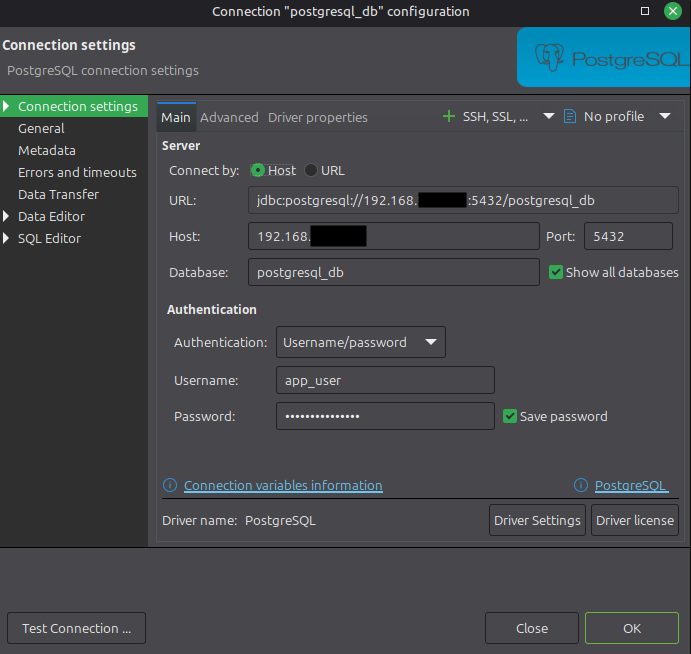

Creamos una nueva base de datos de nombre **paises**

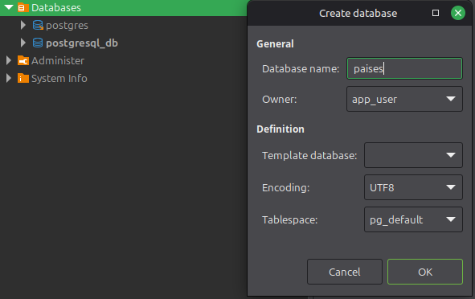

Creamos un nuevo query para crear la tabla de paises

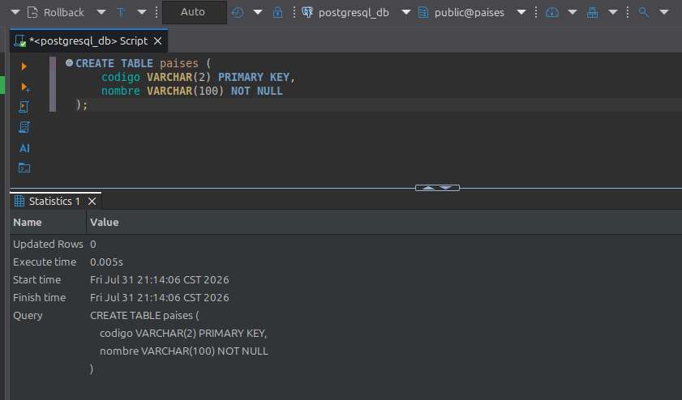


```sql
CREATE TABLE paises (
    codigo VARCHAR(2) PRIMARY KEY,
    nombre VARCHAR(100) NOT NULL
);
```

Ingresamos algunos datos de ejemplo con el siguiente query

```bash
INSERT INTO paises (codigo, nombre)
VALUES
    ('AR', 'Argentina'),
    ('AU', 'Australia'),
    ('AT', 'Austria'),
    ('BE', 'Bélgica'),
    ('BO', 'Bolivia'),
    ('BR', 'Brasil'),
    ('CA', 'Canadá'),
    ('CL', 'Chile'),
    ('CN', 'China'),
    ('CO', 'Colombia'),
    ('CR', 'Costa Rica'),
    ('HR', 'Croacia'),
    ('CU', 'Cuba'),
    ('DK', 'Dinamarca'),
    ('DO', 'República Dominicana'),
    ('EC', 'Ecuador'),
    ('EG', 'Egipto'),
    ('SV', 'El Salvador'),
    ('FI', 'Finlandia'),
    ('FR', 'Francia'),
    ('DE', 'Alemania'),
    ('GR', 'Grecia'),
    ('GT', 'Guatemala'),
    ('HN', 'Honduras'),
    ('HU', 'Hungría'),
    ('IN', 'India'),
    ('ID', 'Indonesia'),
    ('IE', 'Irlanda'),
    ('IL', 'Israel'),
    ('IT', 'Italia'),
    ('JP', 'Japón'),
    ('KR', 'Corea del Sur'),
    ('MX', 'México'),
    ('MA', 'Marruecos'),
    ('NL', 'Países Bajos'),
    ('NZ', 'Nueva Zelanda'),
    ('NI', 'Nicaragua'),
    ('NO', 'Noruega'),
    ('PA', 'Panamá'),
    ('PY', 'Paraguay'),
    ('PE', 'Perú'),
    ('PL', 'Polonia'),
    ('PT', 'Portugal'),
    ('RU', 'Rusia'),
    ('ZA', 'Sudáfrica'),
    ('ES', 'España'),
    ('SE', 'Suecia'),
    ('CH', 'Suiza'),
    ('GB', 'Reino Unido'),
    ('US', 'Estados Unidos');
```

## Despliegue de aplicación

Para este ejemplo, se realizo una aplicación sencilla de un API REST que regresa nombres de países, la aplicación fue implementada utilizando las siguientes tecnologías:
- Jakarta EE 10
- Jakarta EE Profile Platform
- Java 21

La estructura del proyecto es la siguiente:

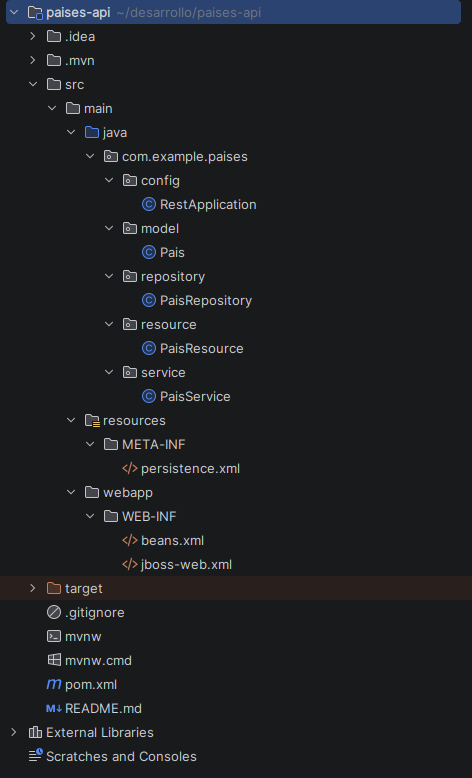

La conexión a la base de datos debe realizarse mediante el DataSource configurado en JBoss *(DemoDS)*. En este ejemplo, la referencia al DataSource se define en el archivo **persistence.xml**, con la siguiente configuración:

```xml
<?xml version="1.0" encoding="UTF-8"?>
<persistence xmlns="https://jakarta.ee/xml/ns/persistence"
             xmlns:xsi="http://www.w3.org/2001/XMLSchema-instance"
             xsi:schemaLocation="
                 https://jakarta.ee/xml/ns/persistence
                 https://jakarta.ee/xml/ns/persistence/persistence_3_1.xsd"
             version="3.1">
    <persistence-unit name="PaisesPU"
                      transaction-type="JTA">
        <jta-data-source>java:/DemoDS</jta-data-source>
        <class>com.example.paises.model.Pais</class>
        <exclude-unlisted-classes>false</exclude-unlisted-classes>
        <properties>
            <property
                    name="jakarta.persistence.schema-generation.database.action"
                    value="none"/>
        </properties>
    </persistence-unit>
</persistence>
```

Una vez finalizado el desarrollo de la aplicación, compilamos el proyecto con el siguiente comando, como resultado, se generará la carpeta **target**, la cual contendrá el archivo **paises-api.war** correspondiente a este ejemplo.

```bash
mvn clean package
```

En este punto ya estamos listos para realizar el despliegue de nuestra aplicación. Existen varias formas de hacerlo, por ejemplo, mediante la CLI de JBoss, copiando directamente el archivo WAR al directorio deployments o, como en este ejemplo, utilizando la consola de administración web de JBoss.

Entramos a la consola web desde un equipo cliente en la ruta **http://127.0.0.1:9990** (con túnel SSH activo) y usando el usuario administrador.

```bash
ssh -L 9990:127.0.0.1:9990 usuario@ip
```

Vamos a **Deployments>Add>Upload Deployment**

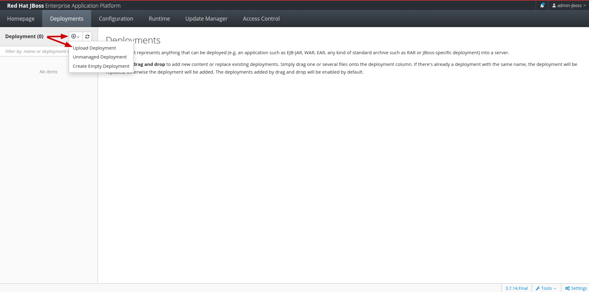

Seleccionamos el archivo **paises-api.war** y dar clic en Next

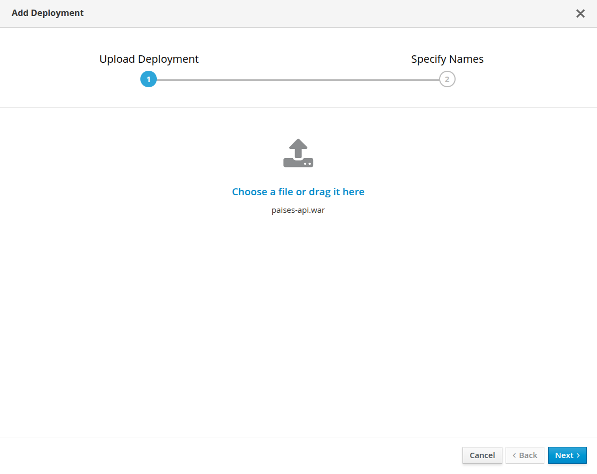

Dejamos la información que se encuentra por default y clic en Finish

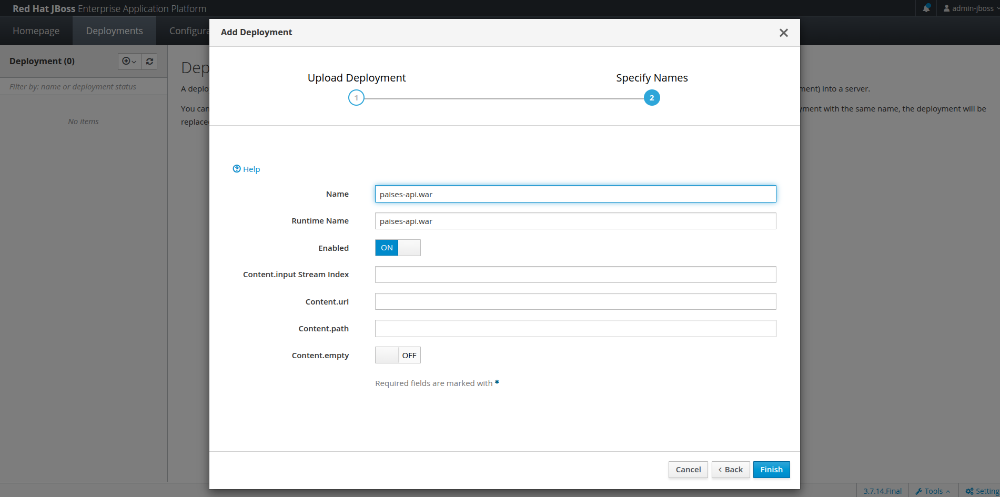

Si el despliegue se realizó correctamente, la aplicación quedará en ejecución y estará lista para recibir solicitudes.

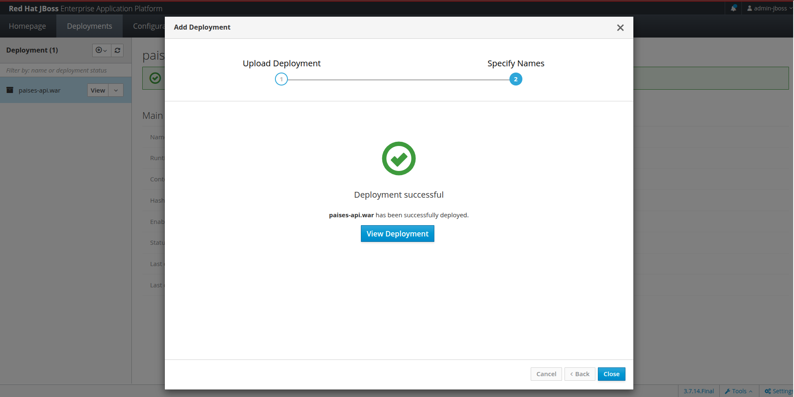

## Prueba de la aplicación web REST

Ingresamos desde un navegador web, utilizando un dispositivo conectado a la misma red que nuestro servidor, en la siguiente URL:

**http://{ip-server}/paises-api/api/paises**

Al acceder a esta dirección, podremos validar que la API REST se encuentra disponible y que responde correctamente con la información de los países almacenados en la base de datos.

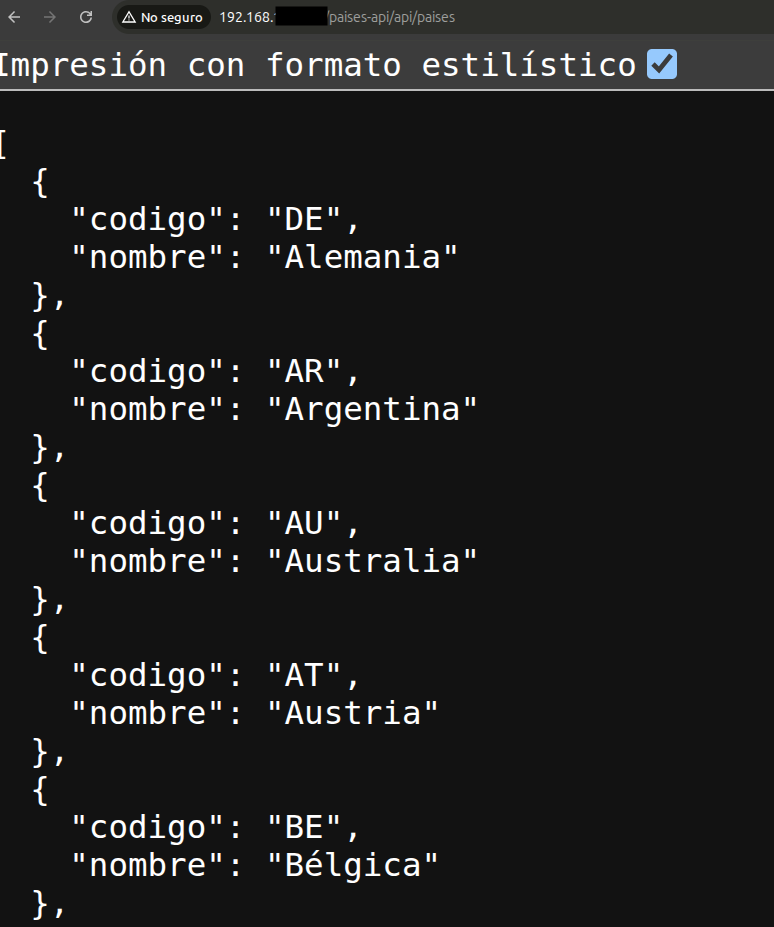

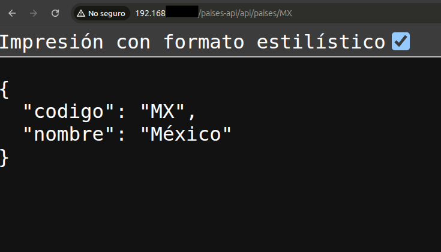

Después de completar todos los pasos de instalación, configuración y desarrollo, hemos logrado realizar el despliegue exitoso de nuestra aplicación.

La aplicación se encuentra funcionando correctamente, conectada a la base de datos PostgreSQL mediante un Datasource configurado en JBoss, permitiendo que nuestra API REST pueda acceder a la información almacenada y responder las solicitudes de los clientes.

## Pool de conexiones

>Un pool de conexiones es una caché de conexiones abiertas y listas para usar en la base de datos, que mantiene el driver. Tu aplicación puede obtener conexiones del pool, realizar operaciones y devolver conexiones al pool. Los pool de conexiones son seguros para subprocesos.

>El pool de conexiones reduce la latencia de la aplicación y el número de nuevas conexiones creadas. El pool crea conexiones al iniciar, y las conexiones retornan automáticamente al pool; las aplicaciones no necesitan devolverlas manualmente. Algunas conexiones están activas y otras están disponibles. Si su aplicación solicita una conexión y hay una disponible en el pool, no es necesario crear una nueva conexión.

[Fuente de información Pool de conexiones](https://www.mongodb.com/es/docs/v8.0/administration/connection-pool-overview/)

En una guía anterior sobre la configuración de WildFly se describieron los pasos para crear el pool de conexiones desde la consola de administración web. Sin embargo, en este ejemplo el DataSource se crea mediante el CLI de JBoss, por lo que el pool de conexiones ya queda configurado con los siguientes parámetros:

- Datasource: DemoDS
- Nombre JNDI: java:/DemoDS
- Pool mínimo: 5 conexiones
- Pool máximo: 20 conexiones
- Precarga del pool: activada

[Configuración para deploy de aplicación Java en servidor WildFly en Linux](https://wiki.softidi.com/Linux/wildfly-deploy)

Con la configuración min-pool-size=5 y max-pool-size=20, JBoss EAP crea y administra un pool que mantiene como mínimo 5 conexiones disponibles hacia PostgreSQL. Esas cinco conexiones se establecen al iniciar el servidor, por lo que la primera petición de la aplicación no necesita esperar a que se abra una conexión. Conforme aumenta la carga, si las cinco conexiones están siendo utilizadas simultáneamente, el servidor crea nuevas conexiones de forma dinámica hasta alcanzar un máximo de 20.
Mientras existan conexiones libres en el pool, las solicitudes las reutilizan en lugar de crear nuevas. Si las 20 conexiones están ocupadas y llega una nueva petición, esta deberá esperar hasta que alguna conexión sea liberada, si transcurre ese tiempo sin obtener una conexión, la petición fallará con un error de agotamiento del pool.

Adicionamente podemos activar las estadísticas, para ello vamos a **Runtime>Server>Datasources>Datasource**, seleccionamos el que creamos, en este caso DemoDS y clic en **Enable Statistics**, se muestra un mensaje para recargar el sistema y damos clic en Reload.

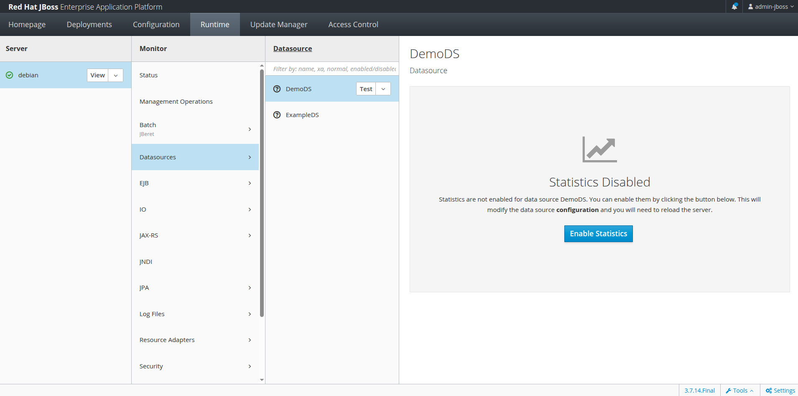

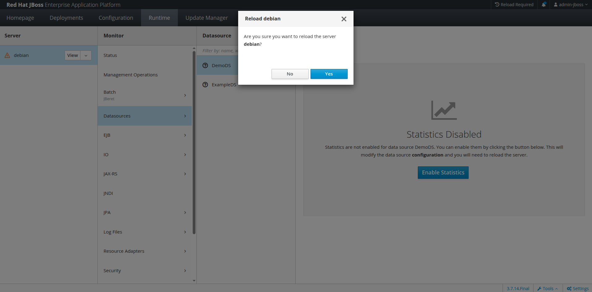

Al recargar la página, podemos observar que se muestran las estadísticas del pool de conexiones con los valores configurados anteriormente.

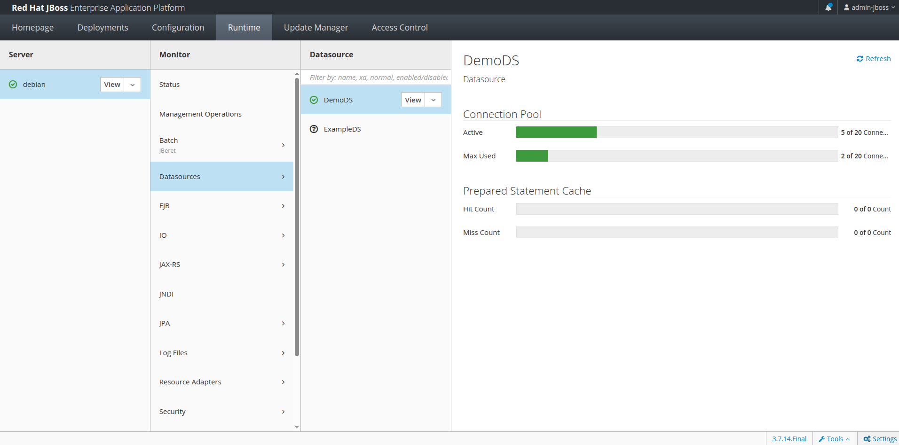

Mientras el API procesa peticiones simultáneas, es posible monitorear las estadísticas del pool de conexiones y observar cómo aumenta el número de conexiones en uso conforme se incrementa la carga de trabajo.

De esta manera, JBoss EAP es el responsable de administrar el pool de conexiones a la base de datos, mientras que las aplicaciones desplegadas únicamente solicitan y liberan conexiones cuando las necesitan. Esto mejora el rendimiento, optimiza el uso de recursos y facilita la administración centralizada de las conexiones.

## Referencias
https://www.debian.org/
https://dbeaver.io/
https://nginx.org/
https://docs.docker.com/engine/install/debian/
https://www.mongodb.com/es/docs/v8.0/administration/connection-pool-overview/