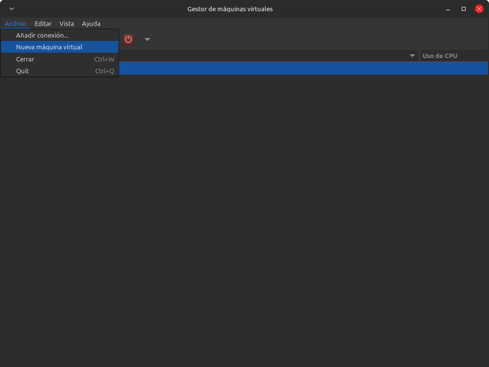
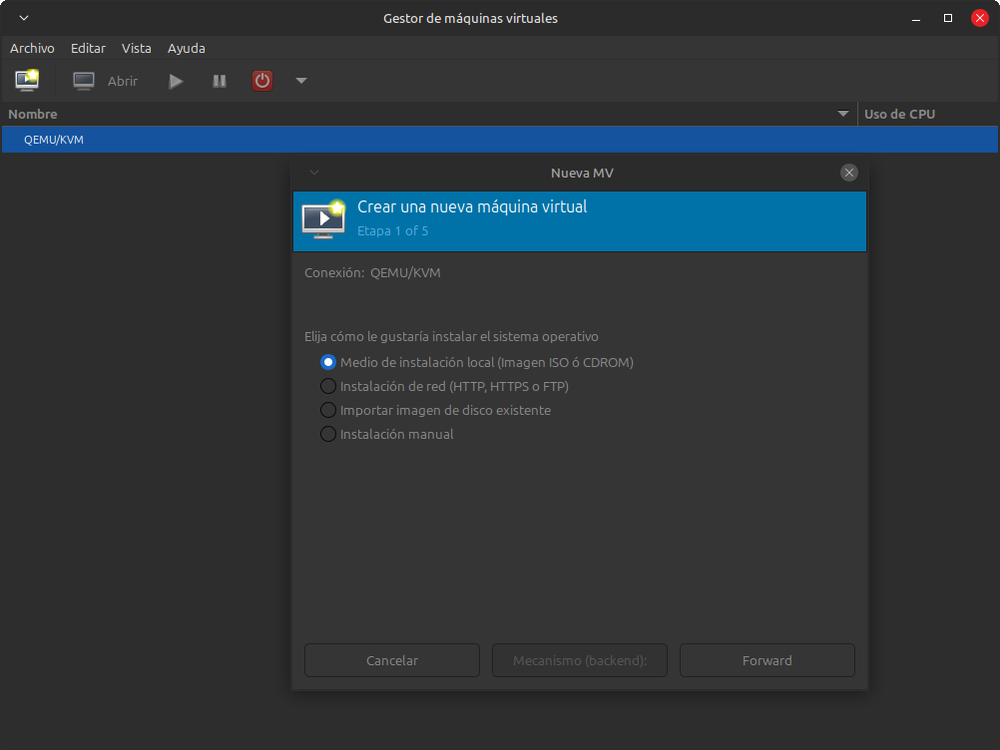
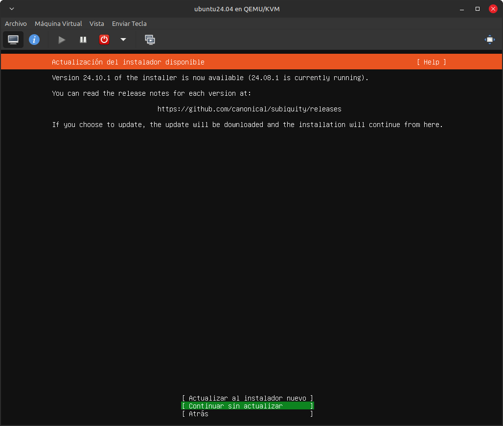

# Creación de maquinas virtuales con KVM en Linux

En esta guía se muestran las configuraciones necesarias para instalar y crear maquinas virtuales por medio de KVM, que es una tecnología de virtualización open source integrada al sistema operativo Linux, puede funcionar como hipervisor y ejecutar maquinas virtuales aisladas.

[Para mayor información visite la siguiente URL](https://www.redhat.com/es/topics/virtualization/what-is-KVM)


## Requerimientos
- Sistema Ubuntu o derivados (En este caso Linux Mint)
- Acceso a terminal como root
- Sistema con capacidad de virtualización
- Espacio en disco duro (al menos 20 GB)

## Instalación

Como primer paso, debemos de comprobar que el sistema admite la virtualización mediante el siguiente comando

```bash
$ egrep -c '(vmx|svm)' /proc/cpuinfo
```

Si el resultado del comando es mayor a 0, significa que si esta habilitada la virtualización del CPU

Con el siguiente comando de igual manera se puede comprobar la capacidad de virtualización

```bash
$ kvm-ok
```

Si todo es correcto, se muestra un resultado como el siguiente
```bash
INFO: /dev/kvm exists
KVM acceleration can be used
```

Actualizamos la lista de paquetes con el siguiente comando
```bash
$ sudo apt update
```

Procedemos a instalar KVM con el siguiente comando
```bash
$ sudo apt install qemu-kvm libvirt-daemon-system libvirt-clients bridge-utils virt-manager
```

Al terminar el proceso de instalación, habilitados el servicio

```bash
$ sudo systemctl enable --now libvirtd.service
```

Agregar el usuario actual del sistema a los grupos de kvm y libvirt con el siguiente comando

```bash
$ sudo usermod -aG kvm $USER
$ sudo usermod -aG libvirt $USER
```

Verificar si el sistema esta configurado para funcionar correctamente con KVM mediante el siguiente comando
```bash
$ sudo virt-host-validate
```


## Creación de maquina virtual

Para este proposito usaremos **virt-manager** que instalamos en pasos anteriores.

> Virt-manager es una herramienta gráfica que nos ayuda a administrar las maquinas virtuales por medio de libvirt principalmente para KVM.

- Descargar una ISO de la distribución deseada, en este caso usaremos Ubuntu Server en la versión 24.04.1 desde la URL https://ubuntu.com/download/server


- Abrir el gestor de máquinas virtuales desde el menú de nuestro sistema


- Seleccionar el menú de archivo y clic en nueva maquina virtual



- Podemos instalar el sistema operativo de diferentes maneras, en este caso usaremos la primera opción de **Medio de instalación local (Imagen ISO o CDROM)** y clic en Forward



- Clic en explorar, buscar y seleccionar el archivo ISO descargado, para este ejemplo ubuntu, clic en Forward


- Configurar la memoria y el CPU, tomar en cuenta el total existente en el sistema host, para este caso colocamos 4 GB de ram y 2 CPU, clic en Forward


- Configurar el total del almacenamiento deseado, en este caso colocamos 25 GB por ser de pruebas, tomar en cuenta de igual manera el total disponible de nuestro disco duro y el proposito de la maquina, clic en Forward.


- En la siguiente pantalla, colocamos el nombre de la maquina y verificamos que las demas opciones esten correctamente.
  Por default, el disco duro virtual se almacena en **/var/lib/libvirt/images** con el formato **.qcow2**


- Al dar clic en finalizar, se muestra una ventana con el inicio de la maquina virtual, seleccionamos la primera opción.


De esta manera creamos e iniciamos la maquina virtual con Ubuntu, pero podemos usar otras distribuciones y configuraciones de CPU y memoria, tener en cuenta el total de CPU, ram y disco duro con el que contamos para evitar asignar muchos recursos y provocar que el sistema host se pueda alentar.

Desde una terminal podemos ejecutar el siguiente comando para verificar las maquinas virtuales, si todo es correcto, observamos la maquina recien creada.
```bash
$ virsh list --all
 Id   Name          State
-----------------------------
 1    ubuntu24.04   running

```

## Instalación del sistema operativo en la maquina virtual

Una vez iniciado el sistema dentro de la maquina virtual, procedemos a instarlo, estos pasos dependen de la distribución seleccionada, para el caso de **Ubuntu Server** es de la siguiente manera.


- Seleccionar el idioma de la instalación


- En este caso nos indica que existe una nueva versión del instalador, pero nosotros continuamos con la actual mediante la opción *Continuar sin actualizar*



- Seleccionar la distribución del teclado, en nuestro caso es *Spanish (Latin American)*


- Para el tipo de instalación, seleccionamos *Ubuntu Server*


- En la sección de configuración de red usamos la configuración pre establecida


- En configuración de proxy lo dejamos en blanco


- En la configuración de mirror dejamos el que detecto, en este caso para México


- Al ser una instalación en una maquina virtual, para la configuración de disco seleccionamos la primera opción *Use an entire disk*, pero podemos configurar las particiones manualmente si asi lo requerimos


- Seleccionando esta opción se crean 2 particiones
  - Partición para BIOS grub
  - Partición para el sistema de tipo ext4 sobre /


- Si estamos seguros del particionado, en la ventana de confirmación seleccionamos *Continuar*


- Configurar el nombre de usuario y contraseña para el sistema


- Opcionalmente podemos actualizar a Ubuntu Pro, pero para este caso no lo activamos, seleccionamos *Skip for now*
  [Acerca de Ubuntu Pro](https://ubuntu.com/pro)


- Seleccionamos *Instalar servidor OpenSSH* para poder conectarmos mas adelante a nuestro sistema desde la terminal por medio de SSH

  [Acerca de SSH](https://www.cloudflare.com/es-es/learning/access-management/what-is-ssh/)


- Para este caso no seleccionamos snaps y continuamos


- Terminamos de configurar las opciones y se inicia la instalación del sistema, este proceso puede tomar unos minutos


- Al terminar el proceso, seleccionamos la opción de *Reiniciar ahora*


- Al reiniciar, se muestra la pantalla de login para ingresar a nuestro sistema instalado, para ello colocamos las credenciales configuradas en la instalación


- Si todo es correcto, podemos ingresar a la nueva instalación de Ubuntu 24 mediante KVM en un equipo con sistema host Linux Mint 22

## Ingresar al sistema mediante SSH

Alternativamente, podemos ingresar al sistema mediante SSH desde nuestro equipo host si es que se selecciono OpenSSH al momento de la instalación, o bien, se puede instalar posteriormente

- Verificamos que IP tiene el sistema mediante el comando 

```bash
$ ip a
```

- Abrimos la terminal en el sistema host e ingresamos con el siguiente comando, cuando se nos solicite colocamos la contraseña
  
```bash
$ ssh ubuntu@ip-vm
```


## Referencias
https://ubuntu.com/blog/kvm-hyphervisor
https://www.redhat.com/es/topics/virtualization/what-is-KVM
https://virt-manager.org/
