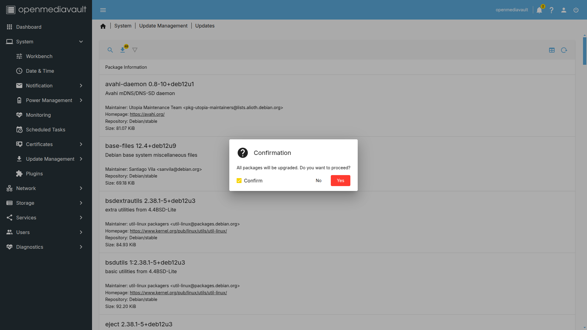

# Instalación de Openmediavault en KVM

En esta guía se muestra el proceso para instalar y configurar Openmediavault en una máquina virtual con KVM en sistema host Linux Mint.

## Requerimientos
- KVM instalado en sistema host (En este caso Linux Mint)
- Sistema con capacidad de virtualización
- Espacio en disco duro (al menos 60 GB para este ejercicio)
- Al menos 8 GB de RAM

Ver detalle acerca de los requerimientos para la instalación del sistema
https://docs.openmediavault.org/en/stable/prerequisites.html

## Instalación de KVM

Para instalar KVM en Linux Mint, podemos ver la siguiente guía

- [Creación de máquinas virtuales con KVM en Linux](/linux/kvmLinux.md)

## Creación de máquina virtual

- Descargar la ISO de OMV (Openmediavault) desde la siguiente URL [OMV ISO](https://www.openmediavault.org/download.html)

- Abrir el gestor de máquinas virtuales desde el menú de nuestro sistema
 

- Seleccionar el menú de archivo y clic en nueva máquina virtual

- Podemos instalar el sistema operativo de diferentes maneras, en este caso usaremos la primera opción de **Medio de instalación local (Imagen ISO o CDROM)** y clic en Forward

- Clic en explorar, buscar y seleccionar el archivo ISO descargado, en la sección de **Elija el sistema operativo que va a instalar**, seleccionar Debian y clic en Forward

- Configurar la memoria y el CPU, tomar en cuenta el total existente en el sistema host, para este caso colocamos 4 GB de ram y 2 CPU, clic en Forward

- Para el almacenamiento del sistema operativo de la máquina virtual, seleccionamos 20 GB, mas adelante crearemos otros 2 discos de 20 GB para colocarlos en RAID.

- En la siguiente pantalla, colocamos el nombre de la máquina y verificamos que las demas opciones esten correctamente.
  Por default, el disco duro virtual se almacena en **/var/lib/libvirt/images** con el formato **.qcow2**

- Al dar clic en finalizar, se muestra una ventana con el inicio de la máquina virtual.

## Instalación de Openmediavault

- Seleccionar el idioma, en nuestro caso español y presionar enter

- Seleccionar el país, para este caso México

- En la configuración del teclado, seleccionar Latinoamericano, enter y esperar unos segundos a que realice las configuraciones.

- Configurar el nombre de la máquina en la red, por default openmediavault

- Para el nombre de dominio, lo dejamos en blanco

- Configurar una contraseña para el superusuario

> Se recomienda el uso de una contraseña segura de al menos 12 caracteres e incluir una mezcla de letras mayúsculas y minúsculas, números y caracteres especiales.

- Volvemos a escribir la contraseña de superusuario para validar que la que se escribio en el paso anterior es la misma

- Configuramos la zona horaria en Central para este caso

- Al contar solo con 1 disco duro conectado, inicia el proceso de instalación

> En la instalación, se borran todos los datos para crear las particiones que ocupa el sistema, si cuenta con datos, realizar el respaldo previamente para evitar la perdida de información

- Configuramos la réplica del gestor de paquetes en México

- De la lista que se nos muestra, seleccionamos la deseada, para nuestro caso usamos la primera opción

- La información de proxy la dejamos en blanco y continuamos

- Para instalar el grub, seleccionado el disco principal, en este caso al contar solo con 1, seleccionamos /dev/vda

[Información acerca de grub](https://docs.redhat.com/es/documentation/red_hat_enterprise_linux/6/html/installation_guide/s1-grub-whatis#s1-grub-whatis)

- Con esto, terminamos el proceso de instalación, seleccionamos en continuar y la máquina se reiniciara

## Configuración de Openmediavault

### Acceso desde SSH
Al terminar la instalación, podemos ingresar desde el gestor de máquinas virtuales por medio de una terminal, colocamos el usuario root y la contraseña configurada en el proceso de instalación

### Acceso desde Web

Para poder admistrar el sistema, ingresaremos desde un navegador web colocando la dirección IP que se muestra al iniciar el sistema.
Por default, el usuario es admin y la contraseña openmediavault, la cual cambiaremos mas adelante

### Agregar discos duros
Antes de ingresar con los accesos por default a la configuración en web, procedemos a agregar 2 nuevos discos duros virtuales, la configuración de discos para este ejemplo es de la siguiente manera:

* Disco 1: Sistema operativo
* Disco 2: Disco de almacenamiento de datos en Raid 1
* Disco 3: Disco de almacenamiento de datos en Raid 1

*Si quiere conocer como funciona RAID, puede consultar la siguiente URL: [RAID](https://wiki.archlinux.org/title/RAID_(Espa%C3%B1ol))*

Por recomendación, OpenMediaVault debe instalarse en un disco de almacenamiento diferente de los discos duros utilizados para el almacenamiento NAS, sin embargo, si solo se cuenta con un disco duro, mediante el plugin *ShareRootFs* se puede realizar las carpetas compartidas.

Para este ejemplo se usa 2 discos duros extras para el almacenamiento configurado en RAID 1 (espejo), usted puede configurar el tipo de RAID de acuerdo a los discos duros con los que cuenta y a sus necesidades de almacenamiento.

- Con la máquina en ejecución, clic en vista > detalles

- En la parte inferior, clic en *Añadir hardware*

- En la ventana que se muestra, vamos a agregar un disco duro virtual de 20 GB para este ejemplo, con las siguientes configuraciones, clic en Finalizar

- Al realizar esta configuración, podemos observar que el la parte izquierda se agrego un nuevo VirtIO Disk adicional al que contabamos en la configuración inicial

- Vamos a repetir el proceso para agregar otro disco duro, quedando de la siguiente manera

- Al finalizar este proceso, clic en vista > consola para regresar a la vista inicial de la máquina

### Configuración del sistema

- Al ingresar por primera vez a la configuración web se nos muestra la siguiente pantalla

- En el mensaje con fondo azul de *Information*, clic en *settings page*

- Vamos a seleccionar todos los widgets disponibles para que se muestren en nuestro Dashboard, los cuales al ingresar a este apartado nos muestran información general acerca de todo el sistema, clic en Save

- Al terminar de aplicar la configuración, se muestra el apartado de Dashboard, en el cual podemos visualizar información acerca de:
  - CPU
  - Memoria
  - Discos
  - Sistema de archivos
  - Interfaces de red
  - Servicios
  - Información del sistema

- En la sección de información del sistema se encuentra *Updates available*, al ser una instalación nueva nos indica que si existen actualizaciones, damos clic y se muestra la siguiente pantalla

- Dar clic en el icono de flecha abajo para instalar todas las actualizaciones disponibles en ese momento, en la ventana que se muestra confirmamos la acción, el proceso puede tardar algunos minutos

- Al terminar la actualización, se muestra un mensaje con fondo amarillo para terminar de aplicar los cambios, clic en el icono de verificación 

- En la barra superior se muestra el icono de campana y un número, damos clic en el icono y se indica un mensaje que es necesario reiniciar el sistema para terminar de aplicar las actualizaciones

- Para reiniciar el sistema, en la barra superior dar clic en el icono de power > Reboot, confirmar la acción y esperar

- Al terminar el reinicio, nos solicita que iniciemos sesión nuevamente, en la parte de *updates available* podemos observar que dice no, estar revisando esta sección continuamente para instalar actualizaciones cuando sean requeridas

- Hasta el momento para ingresar al administrador web estamos usando los accesos por default, lo cual no es recomendado, para hacer el cambio en el menú superior dar clic en el icono de usuario > Change Password

- Ingresar una contraseña segura y clic en Save

- En caso de que solo contemos con un disco duro y deseamos usarlo para almacenar información, o bien, si contamos con varios discos pero deseamos guardar información en el disco duro principal donde se encuentra el sistema, vamos a la sección de System > Plugins

- En el cuadro de búsqueda escribir **sharerootfs**, clic en el icono de instalar y esperar un momento a que termine el proceso

### Configuración de RAID 1

> El RAID 1 es un estándar cuyo objetivo es mejorar la seguridad de los datos almacenados, se conoce como mirroring o espejo, todos los datos escritos y guardados en el disco duro 1 se escribirán también en el disco 2 para ofrecer una redundancia completa, entonces, si un disco falla, el siguiente tomará el relevo.

[Acerca de RAID 1](https://www.ionos.mx/digitalguide/servidores/seguridad/raid-1/)

- Para verificar que contamos con los 3 discos para este ejemplo, vamos a Storage > Disks

- En la versión 7 por default no esta la opción de RAID pero podemos instalarla, vamos a System > Plugins y en el buscador colocar openmediavault-md, lo seleccionamos y clic en instalar

- Al instalar el plugin, vamos a Storage > Multiple Device

- Dar clic en el icono de +, en nivel seleccionamos **Mirror** para este ejemplo, pero tenemos varias opciones de acuerdo a lo que necesitemos

- En dispositivos marcamos los 2 discos duros que tenemos disponibles para realizar la configuración

- Al seleccionar los discos, clic en Save

- En la ventana de cambios pendiente, clic en el icono de verificación y esperamos un momento a que termine el proceso

- Al terminar, se muestra de la siguiente manera

### Configuración sistema de archivos

Ya tenemos configurado el RAID con nuestros 2 discos virtuales, que al ser RAID 1, el total de espacio es el total del tamaño de 1 solo disco. 
El siguiente paso es crear el sistema de archivos para poder almacenar la información.

- Ir a Storage > File Systems, en este apartado visualizamos el sistema de archivos del disco duro principal donde esta almacenado el sistema.

- Clic en el icono de +, para el formato seleccionaremos **EXT4**

- Seleccionamos el RAID creado anteriormente y clic en Save

- En File system, seleccionamos el creado en el paso anterior y agregamos un tag para identificarlo, en este caso colocamos RAID1

- En el mensaje de configuraciones pendientes, seleccionamos el icono de verificación

- Al concluir el proceso, podemos observar los 2 File Systems creados, el que contiene la información del sistema **/dev/vda1** y el que usaremos para almacenar los datos configurado en RAID 1 **/dev/md0**

### Configurar carpeta compartida

- Ir a Storage > Shared Folders 

- Clic en el icono de +, asignamos un nombre para la carpeta compartida, en File system seleccionamos */dev/md0*, y que gracias al tag configurado, lo podemos identificar facilmente

- En Relative path colocamos *documentos/* para este ejemplo, permisos dejamos la opción por default, pero aqui dependiendo de lo que requerimos, podemos ajustar los permisos, finalmente agregamos un tag, clic en Save

- Aceptar los cambios de configuración

- De esta manera configuramos que carpeta vamos a compartir, pero aun no se ha compartido, para hacer esta acción vamos a Services > SMB/CIFS > Shares

- Clic en el icono +, en Shared folder seleccionamos la carpeta que acabamos de configurar, colocamos un comentario y dejamos las demas opciones por default, clic en Save

- Posteriormente aceptamos los cambios

- Activamos el servicio de SMB desde Services > SMB/CIFS > Settings, marcando la casilla de **Enabled**

- Aplicamos los cambios 

- De esta manera configuramos la carpeta compartida y habilitamos el servicio SMB, sin embargo, para poder acceder necesitamos crear usuarios con sus correspondientes accesos y permisos

### Configuración de usuarios

- Para poder ver los usuarios registrados en el sistema vamos a Users > Users

- Una ves en este apartado, dar clic en el icono de + y Create

- Colocar el nombre de usuario, contraseña, confirmar la contraseña, en la parte de grupos seleccionar **sambashare**

- Cuando se muestre el mensaje de fondo amarillo, confirmamos la acción 

- Una vez creado el usuario, podemos dar clic en el nombre de usuario y clic en el icono de llave

- Se listan todas las carpetas que se han creado para compartir, aqui podemos configurar los permisos, por ejemplo, si tenemos 5 carpetas y diferentes usuarios pero no queremos que todos puedan ver todas las carpetas, seleccionamos **Read/Write** a las carpetas con acceso y **No access** a las demas

## Acceder a la carpeta compartida desde Linux

Si nuestro sistema host es GNU/Linux, podemos acceder mediante el administrador de archivos y en la barra de búsqueda colocar **smb://{ip}**

Si al momento de crear el share dejamos seleccionada la opción de *Browseable* podemos ver la(s) carpetas compartidas, al dar clic nos solicita la contraseña y accedemos con los datos del usuario creado en pasos anteriores

Al ingresar con los datos correctos, podemos entrar a la carpeta compartida y crear carpetas/archivos, los cuales se almacenan en el servidor NAS creado

# Referencias
https://www.openmediavault.org/
https://docs.redhat.com/es/documentation/red_hat_enterprise_linux/6/html/installation_guide/s1-grub-whatis#s1-grub-whatis
https://www.ionos.mx/digitalguide/servidores/seguridad/raid-1/
