# Configuración para deploy de aplicación Java en servidor WildFly en Linux

En esta guía se describen los pasos necesarios para realizar el despliegue de una aplicación desarrollada con Spring Boot, configurada para conectarse a una base de datos PostgreSQL mediante un Datasource administrado por el servidor WildFly.

## Introducción

En este ejercicio realizaremos el despliegue de una aplicación desarrollada con Spring Boot 4 o superior y Java 21.
Es una API REST sencilla que tiene conexión a base de datos de PostgreSQL.
Aunque lo más habitual es desplegar las aplicaciones de Spring Boot utilizando el servidor embebido que incorporan (Apache Tomcat), en algunos escenarios puede ser necesario desplegarlas sobre un servidor de aplicaciones como WildFly.
Al finalizar el proceso vamos a tener la siguiente configuración:
- Servidor Debian 13
  - WildFly en el puerto 8080 sin acceso directo desde la red
  - Nginx en el puerto 80, con acceso desde la red y configurado como proxy inverso hacia WildFly
  - PostgreSQL en Docker
  - Aplicación Spring Boot 4 y Java 21 API REST

Esta configuración está orientada a un entorno local de desarrollo y pruebas. No obstante, puede servir como referencia para implementar un entorno similar en un servidor en la nube. En ese caso, será necesario considerar configuraciones adicionales que no se abordan en esta guía, como la gestión de dominios, certificados SSL/TLS, medidas de seguridad, firewall y la configuración específica del proveedor de VPS o nube.

## Requisitos
- Servidor Linux con WildFly instalado
- Java 21
- Cliente para realizar las configuraciones
  Equipo con GNU/Linux, si vamos a ingresar desde equipo Windows podemos usar alguna herramienta como MobaXterm, WinSCP o PuTTY.
- Conexión a internet

[Guía de Instalación y configuración de servidor WildFly en Linux](https://wiki.softidi.com/Linux/configuracion-wildfly)

## Instalación de PostgreSQL en Docker

De acuerdo a la documentación oficial de docker, los pasos para instalar en Debian son los siguientes:

```bash
sudo apt update
sudo apt install ca-certificates curl
sudo install -m 0755 -d /etc/apt/keyrings
sudo curl -fsSL https://download.docker.com/linux/debian/gpg -o /etc/apt/keyrings/docker.asc
sudo chmod a+r /etc/apt/keyrings/docker.asc
```

Posteriormente agregar el repositorio en las fuentes
```bash
sudo tee /etc/apt/sources.list.d/docker.sources <<EOF
Types: deb
URIs: https://download.docker.com/linux/debian
Suites: $(. /etc/os-release && echo "$VERSION_CODENAME")
Components: stable
Architectures: $(dpkg --print-architecture)
Signed-By: /etc/apt/keyrings/docker.asc
EOF
```

Actualizamos los repositorios e instalamos

```bash
sudo apt update
sudo apt install docker-ce docker-ce-cli containerd.io docker-buildx-plugin docker-compose-plugin -y
```

El proceso tarda un par de minutos, dependiendo la velocidad de la red, al terminar verificamos el estado que debe indicar **active (running)**

```bash
sudo systemctl status docker
```

Hasta este punto, ya contamos con Docker instalado en el servidor Debian. El siguiente paso consiste en utilizar Docker Compose para realizar la instalación y configuración de la base de datos.

Primero, creamos el directorio donde almacenaremos los archivos necesarios. Para este ejemplo utilizaremos la ruta /opt. Posteriormente, asignamos los permisos correspondientes al usuario y, una vez creado el directorio, nos ubicamos dentro de él para continuar con la configuración.

```bash
sudo mkdir -p /opt/docker/postgresql
sudo chown -R "$USER":"$USER" /opt/docker/postgresql
cd /opt/docker/postgresql
```

Creamos el archivo de configuración de Docker Compose utilizando el siguiente comando

```bash
nano compose.yml
```

Ingresar el siguiente contenido. Recordar que debemos reemplazar los valores definidos en la sección environment por los correspondientes a su propia configuración. En este ejemplo, la contraseña es sencilla únicamente con fines demostrativos; sin embargo, en entornos de producción se recomienda utilizar una contraseña robusta que cumpla con las políticas de seguridad de su organización.

De manera opcional, es posible definir variables de entorno para los valores especificados en la sección environment, lo que permite mejorar la seguridad y facilitar la administración del archivo Docker. Sin embargo, para este ejemplo utilizaremos valores definidos directamente en el archivo con fines didácticos.

```bash
services:
  postgresql:
    image: postgres:17
    container_name: postgresql
    restart: unless-stopped
    environment:
      POSTGRES_DB: postgresql_db
      POSTGRES_USER: app_user
      POSTGRES_PASSWORD: postgresql_pass

    ports:
      - "127.0.0.1:5432:5432"

    volumes:
      - ./data:/var/lib/postgresql/data
```

Guardar con ctrl + o y salir con ctrl + x del editor nano.

Levantar con el siguiente comando

```bash
sudo docker compose up -d
```

La primera vez que se inicia el contenedor, el proceso puede tardar algunos minutos, ya que Docker debe descargar la imagen especificada. En ejecuciones posteriores, el inicio será considerablemente más rápido, puesto que la imagen ya estará disponible de forma local.

Para verificar el estado de los contenedores, ejecutamos el siguiente comando:

```bash
sudo docker ps
```

Con esto, Docker se encuentra instalado y el contenedor con la base de datos está en ejecución, listo para recibir conexiones y ser utilizado por las aplicaciones que requieran acceder.

## Configuración de conexión a BD de PostgreSQL

Conectarse al servidor por SSH con el comando:

```bash
ssh usuario@ip
```

El primer paso es descargar el driver de la base de datos, para este caso JDBC de Postgresql, entrar en la siguiente URL: https://jdbc.postgresql.org/download/

Ir a la sección de Java 8 o superior, clic derecho sobre el botón de **Download** y copiar dirección de enlace.

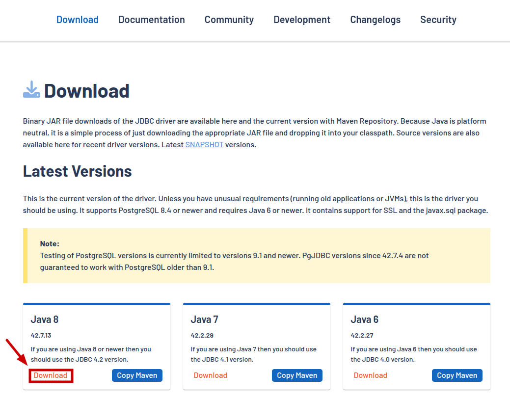

Ejecutar el siguiente comando desde el servidor:

```bash
wget https://jdbc.postgresql.org/download/postgresql-42.7.13.jar
```

Crear las carpetas necesarias para el driver

```bash
sudo mkdir -p /opt/wildfly/modules/org/postgresql/main
```

Copiar el driver descargado en la carpeta creada

```bash
sudo cp postgresql-42.7.13.jar /opt/wildfly/modules/org/postgresql/main
```

Creación del archivo de configuración module.xml

```bash
sudo nano /opt/wildfly/modules/org/postgresql/main/module.xml
```

Ingresar el siguiente contenido para el driver de postgresql, en caso de que la versión descargada sea diferente a la indicada, cambiarla en la parte de **resource-root path=**

```xml
<?xml version="1.0" encoding="UTF-8"?>
<module xmlns="urn:jboss:module:1.9" name="org.postgresql">

    <resources>
        <resource-root path="postgresql-42.7.13.jar"/>
    </resources>

    <dependencies>
        <module name="java.sql"/>
        <module name="java.naming"/>
        <module name="jakarta.transaction.api"/>
    </dependencies>

</module>
```

El siguiente paso consiste en registrar el nuevo driver desde la CLI de WildFly. Para ello, nos conectamos utilizando el siguiente comando e ingresamos el usuario y la contraseña configurados previamente al crear el usuario administrador.

```bash
/opt/wildfly/bin/jboss-cli.sh --connect
```

Una vez conectados, lo registramos de la siguiente manera:

```bash
/subsystem=datasources/jdbc-driver=postgresql:add(driver-name=postgresql,driver-module-name=org.postgresql,driver-class-name=org.postgresql.Driver)
```

Si los parámetros y el comando en general es correcto, se muestra el siguiente mensaje de éxito:

```bash
{"outcome" => "success"}
```

Para salir, escribimos exit y enter
```bash
exit
```

De esta manera, ya contamos con el driver registrado y esta listo para ser usado como datasource, para realizar esta configuración accedemos a la consola de administración en la url: http://127.0.0.1:9990
Recordar que para acceder se realiza el túnel de SSH por seguridad.

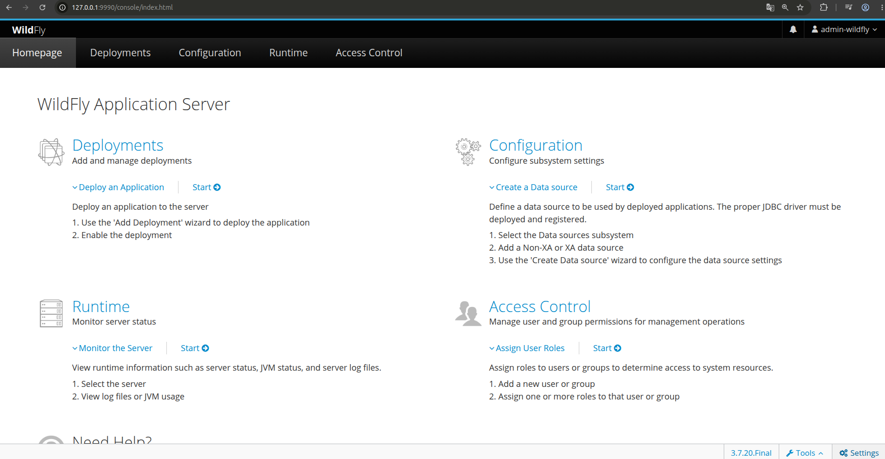

Entrar con las credenciales de administrador e ir a **Configuration>Subsystems>Datasources & Drivers > JDBC Drivers**

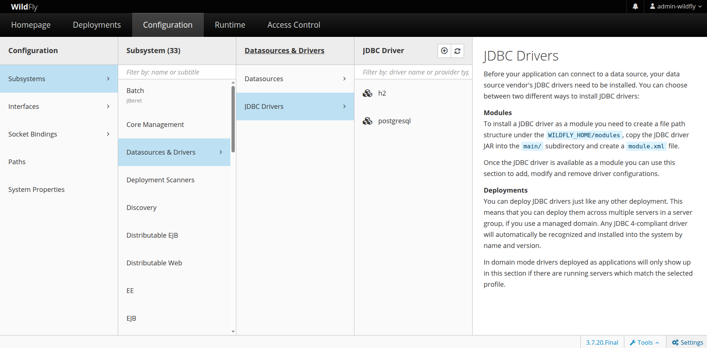

Lo primero que debemos verificar es si el driver de PostgreSQL está disponible. En este caso, podemos observar que sí está visible y confirmar que la versión corresponde a la misma que se instaló en los pasos anteriores.

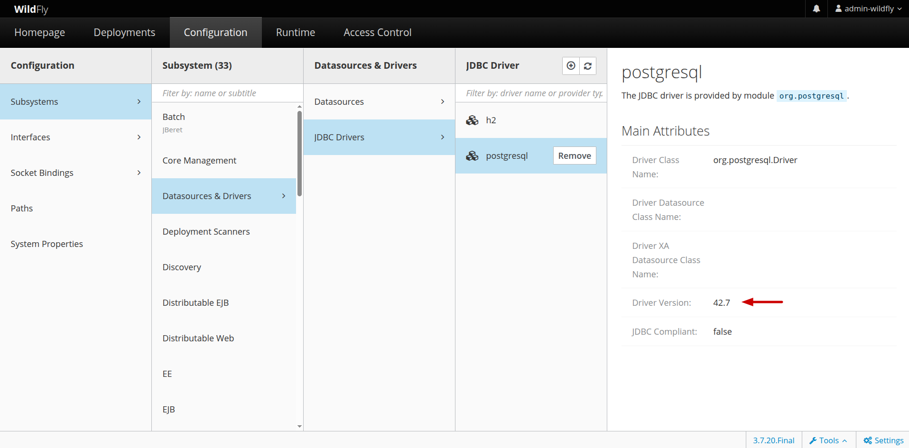


Para agregar un Datasource nuevo vamos a **Configuration>Subsystems>Datasources & Drivers > Datasources**

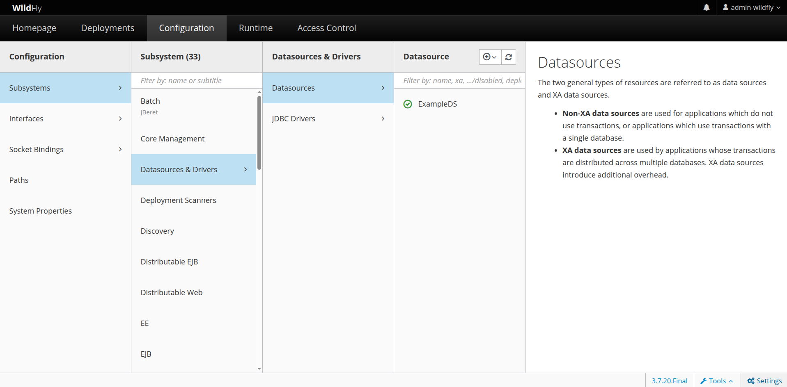

Dar clic en el icono de + y Add Datasource.

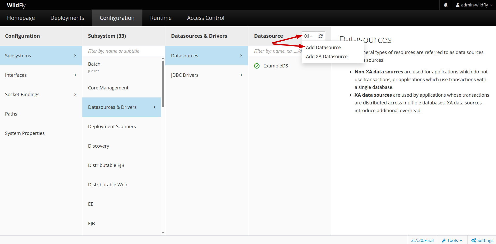

En Template, seleccionar para este ejemplo PostgreSQL y clic en Next.

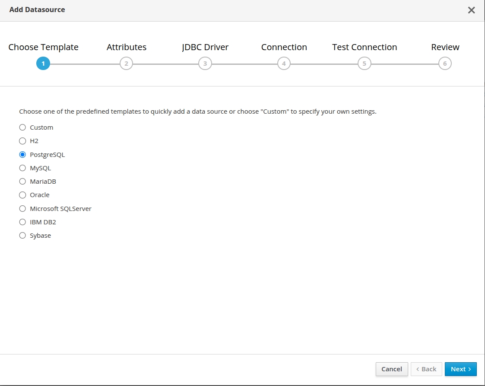


Ingresar el Name y JNDI Name, para este caso de la siguiente manera.

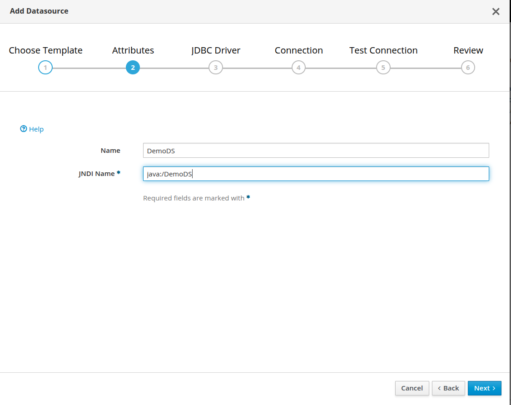

En la siguiente pantalla, verificar que el Driver Name y Class Name es el que indicamos al momento de la instalación, para este caso, es correcto y continuamos.

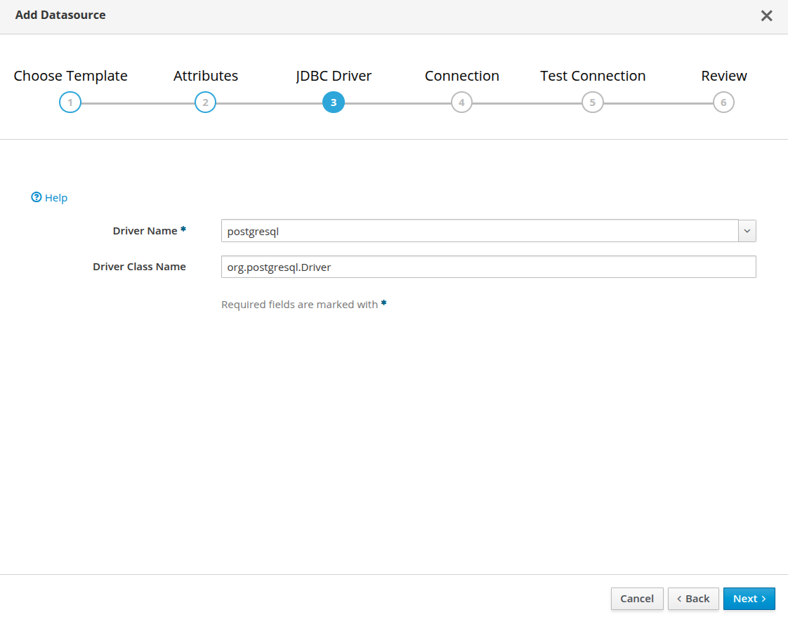

En el siguiente paso configuraremos la conexión a la base de datos. Para ello, es necesario proporcionar el nombre de la base de datos, el usuario y la contraseña, los cuales fueron definidos al crear el contenedor en el archivo compose.yml.

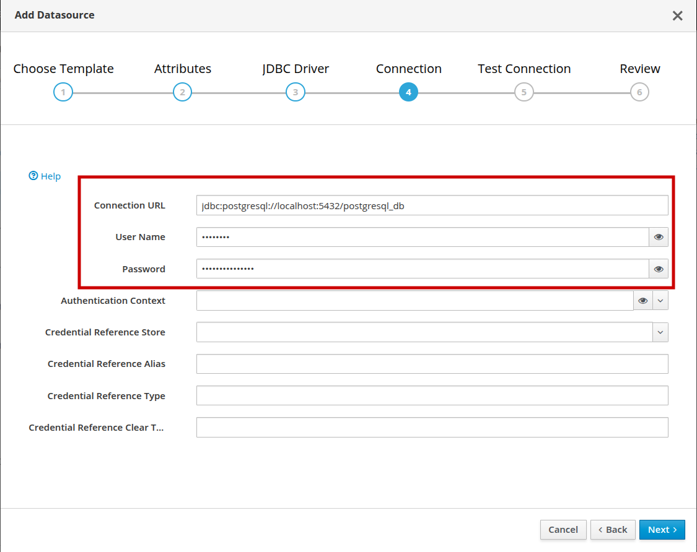

El siguiente paso consiste en validar la conexión con la base de datos. Para ello, hacemos clic en **Test Connection** y verificamos que la conexión se establezca correctamente.

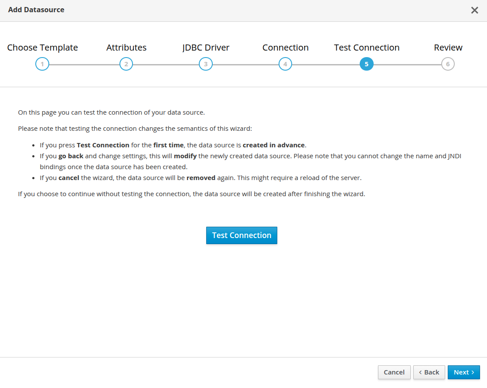

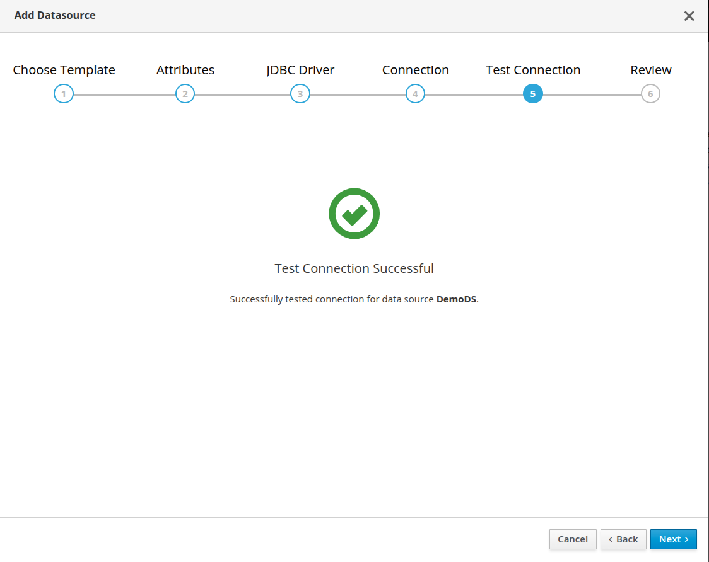

En el último paso podemos revisar las configuraciones realizadas. Si todos los valores son correctos, hacemos clic en el botón Finish para finalizar el proceso.

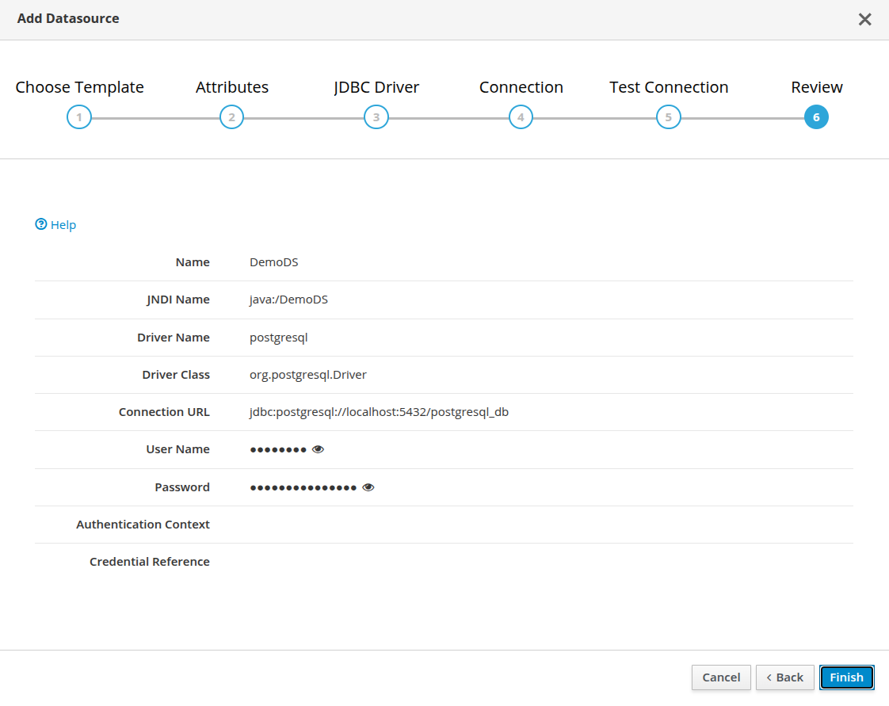


## Aplicación Spring Boot 4

Crearemos una aplicación sencilla con Spring Boot 4 utilizando Java 21. El objetivo será desarrollar una API REST que permita consultar y retornar la información de todos los países almacenados en una base de datos PostgreSQL.


Ingresamos a la URL https://start.spring.io/ para crear el proyecto inicial de Spring Boot con las siguientes configuraciones:

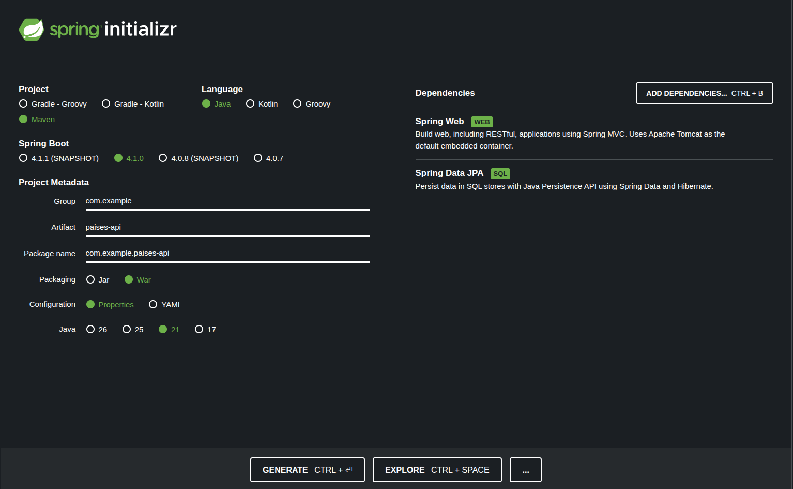

Hacemos clic en **Generate** para descargar el proyecto. Una vez descargado, descomprimimos el archivo y lo abrimos en nuestro IDE de preferencia; para este ejemplo utilizaremos IntelliJ IDEA.

Dentro del paquete principal del proyecto, creamos un nuevo paquete llamado model. A continuación, dentro de este paquete, creamos la clase Pais.java con el siguiente código:

```java
package com.example.paises_api.model;

import jakarta.persistence.*;

@Entity
@Table(name = "pais")
public class Pais {

    @Id
    @GeneratedValue(strategy = GenerationType.IDENTITY)
    private Long id;
    @Column(nullable = false, length = 2, unique = true)
    private String codigo;
    private String nombre;

    public Pais() {
    }

    public Pais(String codigo, String nombre) {
        this.codigo = codigo;
        this.nombre = nombre;
    }

    public Long getId() {
        return id;
    }

    public String getCodigo() {
        return codigo;
    }

    public String getNombre() {
        return nombre;
    }
}

```

Dentro del paquete principal del proyecto, creamos un nuevo paquete llamado repository y la interface PaisRepository.java

```java
package com.example.paises_api.repository;

import com.example.paises_api.model.Pais;
import org.springframework.data.jpa.repository.JpaRepository;

import java.util.List;

public interface PaisRepository extends JpaRepository<Pais, Long> {
    List<Pais> findByNombreContainingIgnoreCaseOrderByNombreAsc(String nombre);
}

```

La siguiente capa que vamos a crear es el servicio, para ello creamos el paquete service y la clase PaisService.java


```java
package com.example.paises_api.service;

import com.example.paises_api.model.Pais;
import com.example.paises_api.repository.PaisRepository;
import org.springframework.stereotype.Service;
import org.springframework.util.StringUtils;

import java.util.List;

@Service
public class PaisService {

    private final PaisRepository repository;

    public PaisService(PaisRepository repository) {
        this.repository = repository;
    }

    public List<Pais> obtenerTodos() {
        return repository.findAll();
    }

    public List<Pais> buscarPorNombre(String nombre) {
        if (!StringUtils.hasText(nombre)) {
            return obtenerTodos();
        }
        return repository.findByNombreContainingIgnoreCaseOrderByNombreAsc(nombre.trim());
    }

}

```

La siguiente capa es el controlador REST, para ello creamos el paquete controller y la clase PaisController.java

```java
package com.example.paises_api.controller;

import com.example.paises_api.model.Pais;
import com.example.paises_api.service.PaisService;
import org.springframework.web.bind.annotation.GetMapping;
import org.springframework.web.bind.annotation.RequestMapping;
import org.springframework.web.bind.annotation.RequestParam;
import org.springframework.web.bind.annotation.RestController;

import java.util.List;

@RestController
@RequestMapping("/api/paises")
public class PaisController {
    private final PaisService service;

    public PaisController(PaisService service) {
        this.service = service;
    }

    @GetMapping
    public List<Pais> obtenerPaises(@RequestParam(required = false) String nombre) {
        if (nombre == null) {
            return service.obtenerTodos();
        }
        return service.buscarPorNombre(nombre);
    }

    @GetMapping("/buscar")
    public List<Pais> buscarPorNombre(@RequestParam String nombre) {
        return service.buscarPorNombre(nombre);
    }
}

```

El siguiente paso consiste en configurar la conexión a la base de datos. Normalmente, para establecer esta conexión se requiere especificar el driver correspondiente, en este caso el de PostgreSQL, el cual puede utilizarse directamente en ambientes de desarrollo.

Sin embargo, para este ejemplo realizaremos la configuración mediante un Datasource administrado por WildFly. Por ello, la conexión se definirá de la siguiente manera en el archivo de propiedades ubicado en:

**src/main/resources/application.properties**

```properties
spring.application.name=paises-api

# datasource que configuramos en WildFly
spring.datasource.jndi-name=java:/DemoDS
spring.jpa.hibernate.ddl-auto=update
spring.jpa.properties.hibernate.format_sql=true

# Llamar al archivo data.sql despues de crear las tablas
spring.jpa.defer-datasource-initialization=true
spring.sql.init.mode=always
spring.sql.init.continue-on-error=false
```

Como se indicó en la configuración, utilizaremos un archivo de carga de datos que se ejecutará automáticamente al iniciar la aplicación. Para ello, creamos el archivo data.sql (con 50 registros para las pruebas) en la siguiente ruta: **src/main/resources/data.sql**

```sql
INSERT INTO pais (codigo, nombre)
VALUES
    ('AR', 'Argentina'),
    ('AU', 'Australia'),
    ('AT', 'Austria'),
    ('BE', 'Bélgica'),
    ('BO', 'Bolivia'),
    ('BR', 'Brasil'),
    ('CA', 'Canadá'),
    ('CL', 'Chile'),
    ('CN', 'China'),
    ('CO', 'Colombia'),
    ('CR', 'Costa Rica'),
    ('HR', 'Croacia'),
    ('CU', 'Cuba'),
    ('DK', 'Dinamarca'),
    ('DO', 'República Dominicana'),
    ('EC', 'Ecuador'),
    ('EG', 'Egipto'),
    ('SV', 'El Salvador'),
    ('FI', 'Finlandia'),
    ('FR', 'Francia'),
    ('DE', 'Alemania'),
    ('GR', 'Grecia'),
    ('GT', 'Guatemala'),
    ('HN', 'Honduras'),
    ('HU', 'Hungría'),
    ('IN', 'India'),
    ('ID', 'Indonesia'),
    ('IE', 'Irlanda'),
    ('IL', 'Israel'),
    ('IT', 'Italia'),
    ('JP', 'Japón'),
    ('KR', 'Corea del Sur'),
    ('MX', 'México'),
    ('MA', 'Marruecos'),
    ('NL', 'Países Bajos'),
    ('NZ', 'Nueva Zelanda'),
    ('NI', 'Nicaragua'),
    ('NO', 'Noruega'),
    ('PA', 'Panamá'),
    ('PY', 'Paraguay'),
    ('PE', 'Perú'),
    ('PL', 'Polonia'),
    ('PT', 'Portugal'),
    ('RU', 'Rusia'),
    ('ZA', 'Sudáfrica'),
    ('ES', 'España'),
    ('SE', 'Suecia'),
    ('CH', 'Suiza'),
    ('GB', 'Reino Unido'),
    ('US', 'Estados Unidos')
ON CONFLICT (codigo) DO UPDATE
SET nombre = EXCLUDED.nombre;
```

En algunos casos pueden presentarse conflictos entre las bibliotecas que proporciona WildFly y las dependencias de Hibernate incluidas en el proyecto de Spring Boot. Para evitar este tipo de incompatibilidades, crearemos un archivo de configuración que indique a WildFly que utilice las bibliotecas incluidas en la aplicación.

Para ello, creamos la ruta **src/main/webapp/WEB-INF** y, dentro de ella, el archivo **jboss-deployment-structure.xml** con el siguiente contenido:

```xml
<?xml version="1.0" encoding="UTF-8"?>
<jboss-deployment-structure xmlns="urn:jboss:deployment-structure:1.3">
    <deployment>
        <exclude-subsystems>
            <subsystem name="logging"/>
        </exclude-subsystems>
        <exclusions>
            <module name="org.hibernate"/>
            <module name="org.hibernate.envers"/>
            <module name="org.slf4j"/>
            <module name="org.slf4j.impl"/>
        </exclusions>
    </deployment>
</jboss-deployment-structure>
```

En IntelliJ puede marcar un error de que la URL no esta registrada, pero WildFly sí puede procesarlo correctamente al desplegar el WAR.

*Nota: Este es un proyecto sencillo cuyo objetivo es demostrar la integración de una API desarrollada con Spring Boot, PostgreSQL y WildFly. En proyectos de mayor tamaño o destinados a entornos de producción, se recomienda seguir buenas prácticas de desarrollo, como el uso de interfaces, DTO (Data Transfer Objects), excepciones personalizadas, manejo centralizado de excepciones mediante @ControllerAdvice, validaciones con @Valid, implementación de Spring Security, pruebas automatizadas y una arquitectura por capas, entre otras.*

## Despliegue de la aplicación Spring Boot

Debemos asegurarnos de que Tomcat no se incluya en el archivo WAR. Para ello, revisamos el archivo **pom.xml** y verificamos que la dependencia de Tomcat tenga definido el scope como provided.

```xml
<dependency>
    <groupId>org.springframework.boot</groupId>
    <artifactId>spring-boot-starter-tomcat</artifactId>
    <scope>provided</scope>
  </dependency>
```

Asimismo, verificamos que el tipo de empaquetado del proyecto esté configurado como war en el archivo pom.xml, ya que este formato es el requerido para desplegar la aplicación en WildFly.

```xml
<packaging>war</packaging>
```

Con toda la estructura del proyecto lista, procederemos a compilar la aplicación y verificar que el archivo .war se genere correctamente. Para ello, ejecutamos el siguiente comando desde la raíz del proyecto:

```bash
mvn clean package -DskipTests
```

Al finalizar la ejecución del comando, si la compilación se completó correctamente, se generará una nueva carpeta llamada **target**. Dentro de ella se encontrará el archivo **paises-api-0.0.1-SNAPSHOT.war**.

En este punto ya estamos listos para realizar el despliegue de nuestra aplicación. Existen varias formas de hacerlo, por ejemplo, mediante la CLI de WildFly, copiando directamente el archivo WAR al directorio deployments o, como en este ejemplo, utilizando la consola de administración web de WildFly.

Entramos a la consola web desde **http://127.0.0.1:9990** (con túnel SSH activo)

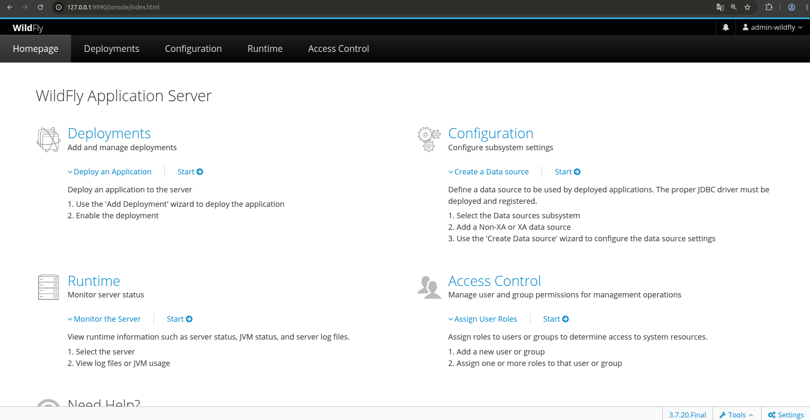

Vamos a **Deployments>Add>Upload Deployment**

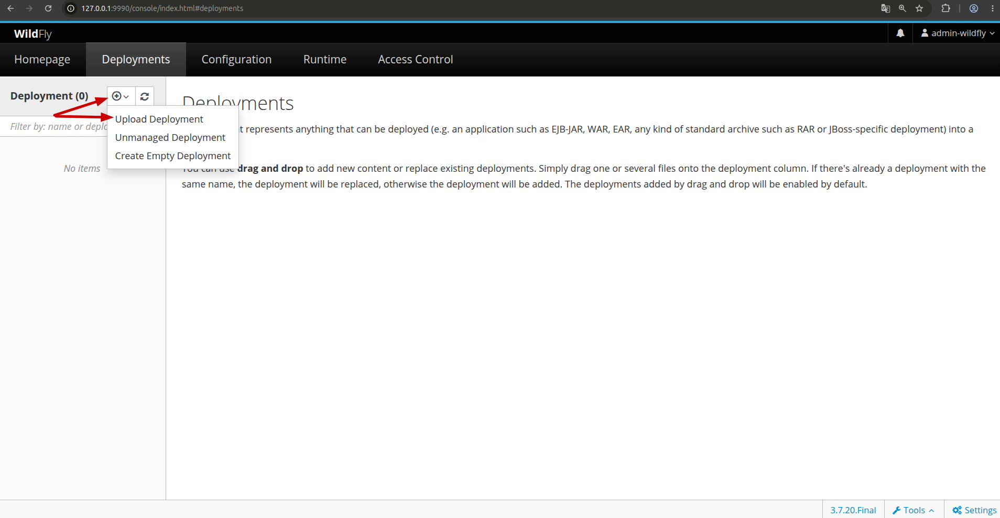

Seleccionamos el archivo **paises-api-0.0.1-SNAPSHOT.war** y dar clic en Next

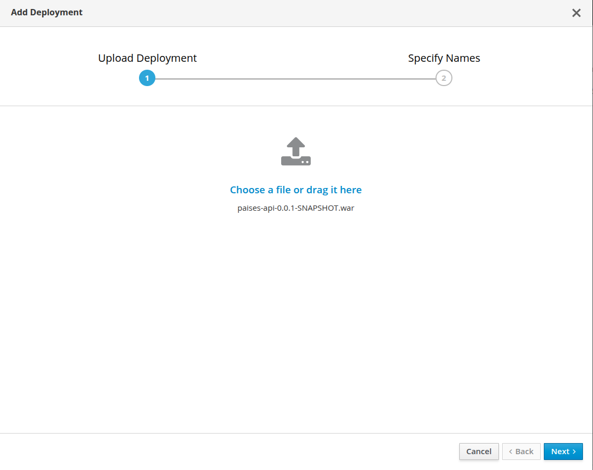

Dejamos la información que se encuentra por default y clic en Finish

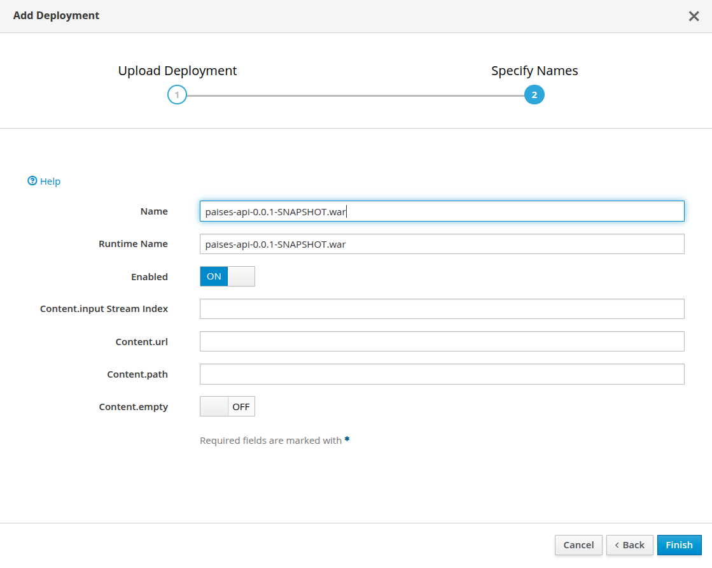

Si el despliegue se realizó correctamente, la aplicación quedará en ejecución y estará lista para recibir solicitudes.

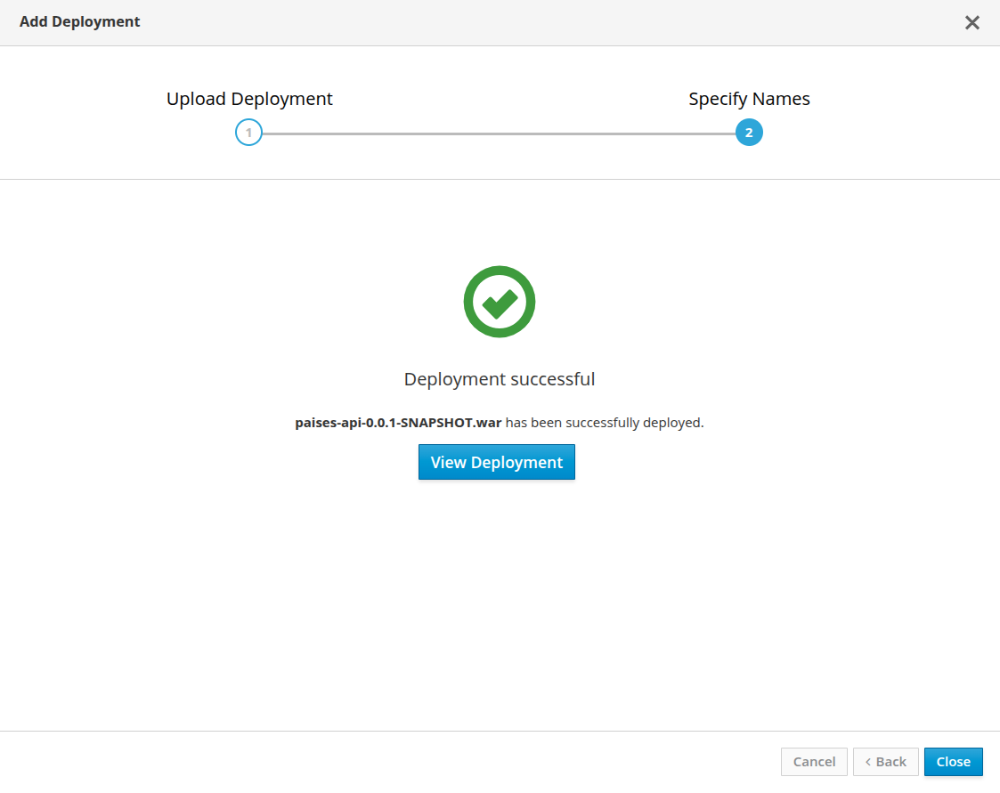

## Prueba de la aplicación web REST

Ingresamos desde un navegador web, utilizando un dispositivo conectado a la misma red que nuestro servidor, a la siguiente URL:

**http://{ip-server}/paises-api-0.0.1-SNAPSHOT/api/paises**

Al acceder a esta dirección, podremos validar que la API REST se encuentra disponible y que responde correctamente con la información de los países almacenados en la base de datos.

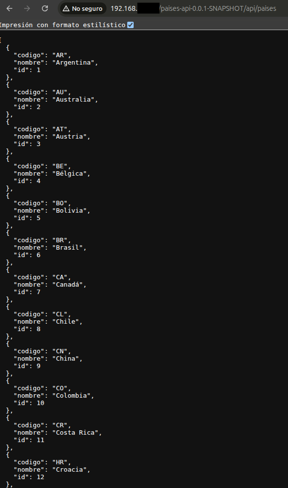

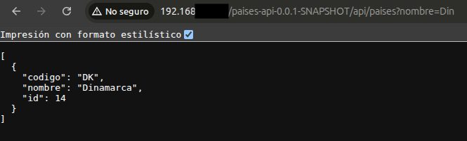


Después de completar todos los pasos de instalación, configuración y desarrollo, hemos logrado realizar el despliegue exitoso de nuestra aplicación.

La aplicación se encuentra funcionando correctamente, conectada a la base de datos PostgreSQL mediante un Datasource configurado en WildFly, permitiendo que nuestra API REST pueda acceder a la información almacenada y responder las solicitudes de los clientes.


## Pool de conexiones

>Un pool de conexiones es una caché de conexiones abiertas y listas para usar en la base de datos, que mantiene el driver. Tu aplicación puede obtener conexiones del pool, realizar operaciones y devolver conexiones al pool. Los pool de conexiones son seguros para subprocesos.


>El pool de conexiones reduce la latencia de la aplicación y el número de nuevas conexiones creadas. El pool crea conexiones al iniciar, y las conexiones retornan automáticamente al pool; las aplicaciones no necesitan devolverlas manualmente. Algunas conexiones están activas y otras están disponibles. Si su aplicación solicita una conexión y hay una disponible en el pool, no es necesario crear una nueva conexión.

[Fuente de información Pool de conexiones](https://www.mongodb.com/es/docs/v8.0/administration/connection-pool-overview/)


Como podemos ver, existen muchas ventajas al usar un pool de conexiones en nuestras aplicaciones, WildFly nos permite configurarlo mediante los siguientes pasos.


Ingresamos a la consola de administración web y vamos a **Subsystems>Configuration>Datasources & Drivers > Datasources**

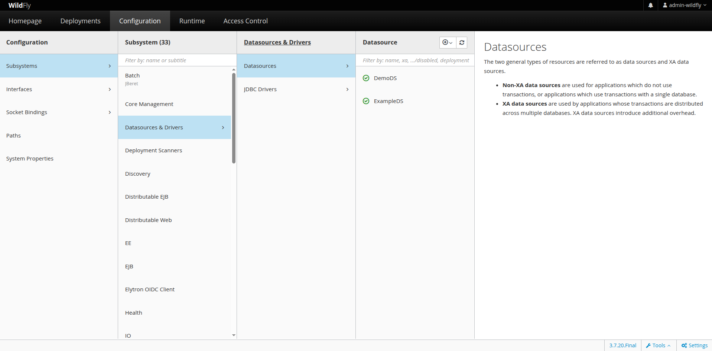

Seleccionar el Datasource creado anteriormente, en este caso de nombre DemoDS y clic en View

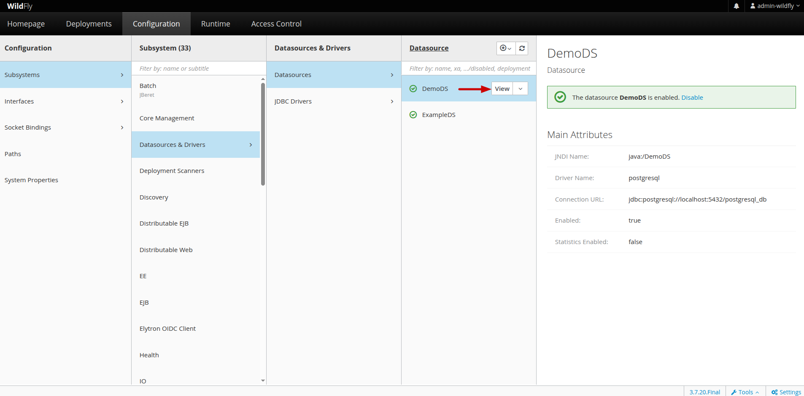

Se muestra la siguiente pantalla, seleccionar la pestaña de Pool

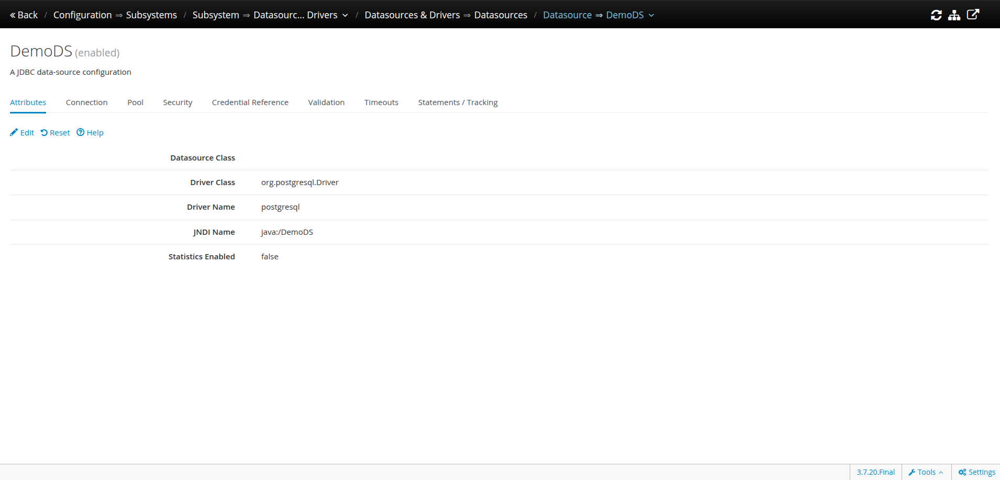

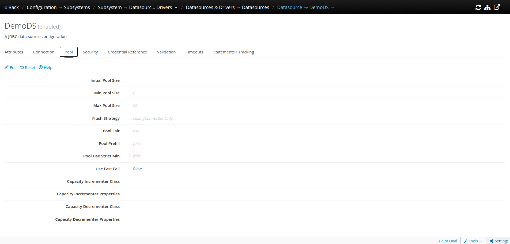

Dar clic en Edit, para este ejemplo al ser un api pequeña, se utilizarán las siguientes configuraciones como referencia. No obstante, estos parámetros pueden variar según las características del servidor donde se realice la implementación, así como los requerimientos de rendimiento, disponibilidad y las necesidades específicas del negocio de cada proyecto.

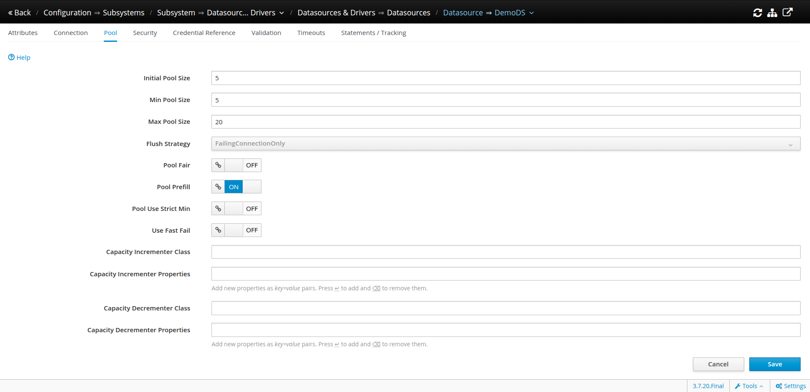

Con esta configuración, logramos lo siguiente:

Cuando se inicia el datasource, se preparan 5 conexiones a la base de datos (BD). El pool puede crecer, de ser necesario, hasta el máximo configurado de 20 conexiones simultáneas. Si una conexión falla, Flush Strategy = FailingConnectionOnly hace que WildFly elimine únicamente la conexión defectuosa. Con Use Fast Fail = OFF, se intenta obtener conexiones válidas en lugar de fallar inmediatamente al detectar el primer problema.

En resumen, se mantienen conexiones listas para evitar esperas iniciales, se permite crecer hasta 20 conexiones cuando aumenta el tráfico y se manejan los errores sin afectar innecesariamente a las conexiones que continúan funcionando correctamente.

Para el siguiente paso vamos a la pestaña de **Validation** y lo dejamos de la siguiente manera, clic en Save al terminar.

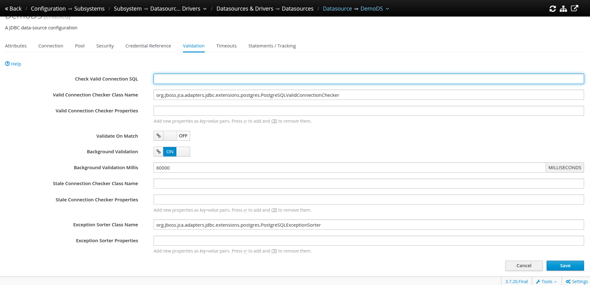

WildFly valida automáticamente las conexiones del pool cada 60 segundos, comprobando que sigan siendo válidas y eliminando aquellas que hayan fallado por algún problema. Al mantener Validate On Match desactivado, se evita realizar una validación cada vez que la aplicación solicita una conexión, reduciendo la latencia y mejorando el rendimiento de la API.

Vamos a la pestaña de **Timeouts** y configuramos lo siguiente

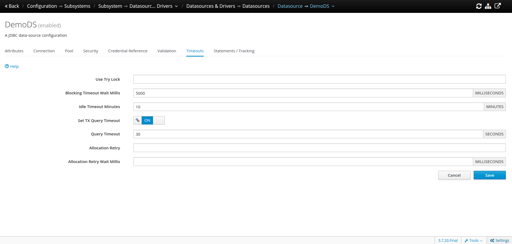

Con esta configuración, WildFly espera hasta 5 segundos por una conexión libre, cierra las conexiones que lleven 10 minutos sin usarse y cancela las consultas SQL que superen 30 segundos de ejecución. Con ello se evita que las peticiones queden bloqueadas y se optimiza el uso de los recursos del servidor y de base de datos.

Adicionamente podemos activar las estadísticas, para ello vamos a **Runtime>Server>Datasources>Datasource**, seleccionamos el que creamos, en este caso DemoDS y clic en **Enable Statistics**, se muestra un mensaje para recargar el sistema y damos clic en Reload.

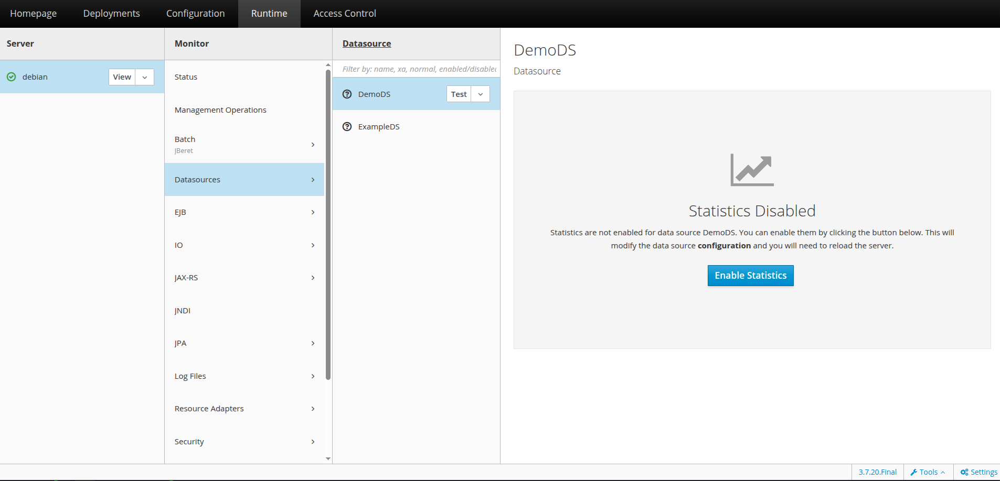

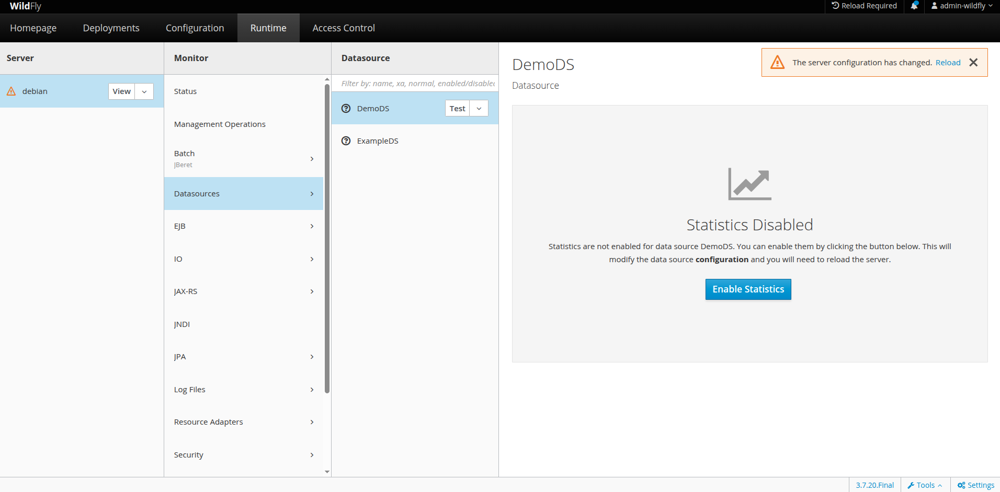

Al recargar la página, podemos observar que se muestran las estadísticas del pool de conexiones con los valores configurados anteriormente.

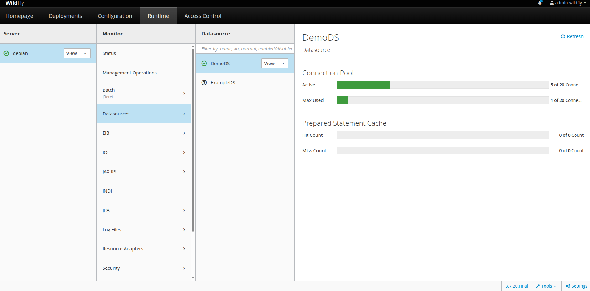

Mientras el API procesa peticiones simultáneas, es posible monitorear las estadísticas del pool de conexiones y observar cómo aumenta el número de conexiones en uso conforme se incrementa la carga de trabajo.

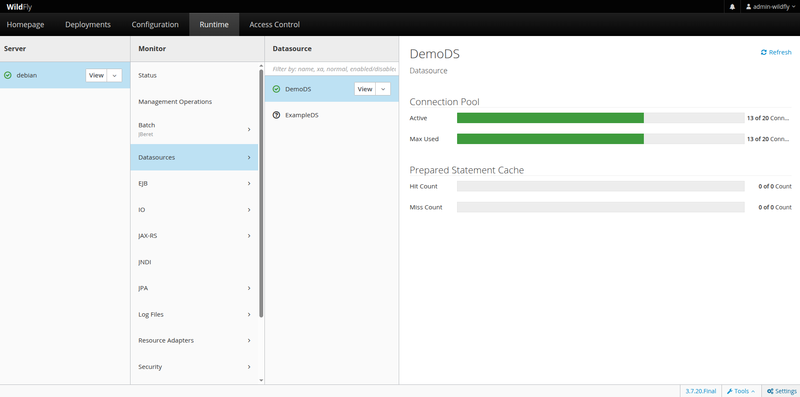

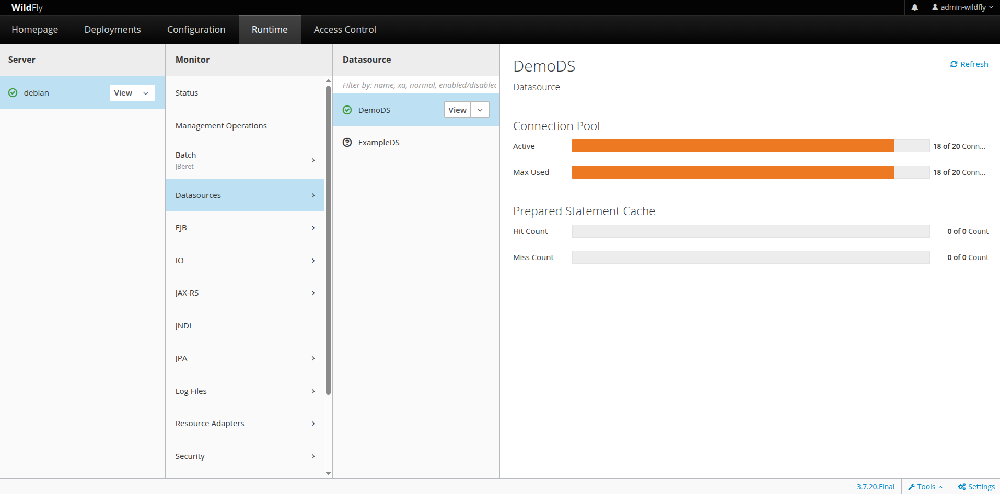


De esta manera, WildFly es el responsable de administrar el pool de conexiones a la base de datos, mientras que las aplicaciones desplegadas únicamente solicitan y liberan conexiones cuando las necesitan. Esto mejora el rendimiento, optimiza el uso de recursos y facilita la administración centralizada de las conexiones.

## Referencias
https://www.debian.org/
https://www.wildfly.org/
https://nginx.org/
https://docs.docker.com/engine/install/debian/
https://www.mongodb.com/es/docs/v8.0/administration/connection-pool-overview/
