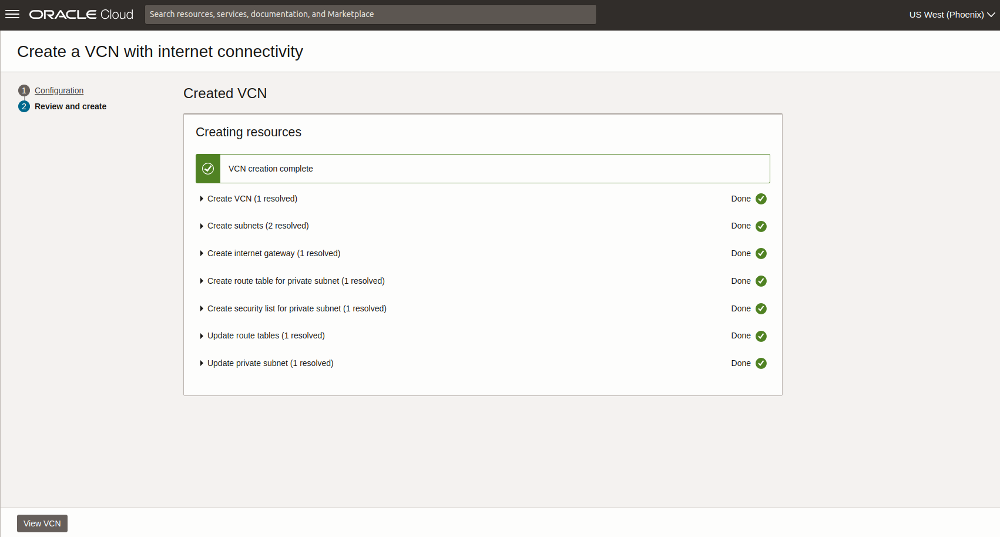

# Creación de Máquina Virtual en Oracle Cloud

En esta guía se muestran las configuraciones necesarias para crear una máquina virtual con el sistema Ubuntu en Oracle Cloud y lograr realizar la conexión con la misma para que posteriormente sea configurada de acuerdo a sus necesidades.

## Requerimientos
- Cuenta en Oracle Cloud (Se puede usar cuenta en modo gratuito)
- Conocimientos básicos en Cloud

## Creación de VM

- Crear compartimiento

> Los compartimentos permiten organizar y controlar el acceso a los recursos. Un compartimento es una recopilación de recursos relacionados (como redes en la nube, instancias informáticas o volúmenes en bloque) a los que solo pueden acceder los grupos a los que haya otorgado permiso un administrador de la organización.
  
Se puede utilizar un compartimiento ya existente en la cuenta, o bien, crear uno nuevo, si se desea crear, buscar compartimientos dentro de la consola de OCI y seleccionar **Compartments**.


Crear uno nuevo seleccionando la opción **"Create Compartment"**, colocar nombre, descripción y compartimiento padre (se puede usar el compartimiento root como padre).


Esperar unos segundos o bien, recargar la pantalla, se listará el nuevo compartimiento creado.


- Crear VCN

> Una VCN es una red definida por software que se configura en los centros de datos de Oracle Cloud Infrastructure en una determinada región. Una subred es una subdivisión de una VCN.
  
El siguiente paso es crear una VCN (se puede usar una existente), para ello, buscar VCN dentro de la consola de OCI y seleccionar **Virtual Cloud Network**.


Al entrar en la pantalla, seleccionar el compartimiento creado en el paso anterior.


Seleccionar **Start VCN Wizard** y posteriormente **Create VCN with Internet Connectivity**, esto va a crear una red con conexión a internet.


En la siguiente pantalla de configuración, ingresar el nombre deseado, el compartimiento de pruebas para este ejemplo, dejar las demas opciones por default.


Seleccionar **Create** y esperar a que el proceso termine.




- Crear instancia

Buscar Instances dentro la consola de OCI y seleccionar.


Seleccionar **Create instance**.


Configurar los siguientes parámetros.

* Name: Colocar el nombre deseado para la instancia.
* Create in compartment: Seleccionar el compartimiento de pruebas para este ejemplo.
* Placement: Dejar los valores por defecto.
* Security: Dejar los valores por defecto.
  
* Image and shape: En imagen seleccionar Ubuntu 20.04 Minimal y en Shape seleccionar VM.Standard.E2.1.Micro (Revisar que tenga la etiqueta Always Free-eligible para este ejemplo).
  Actualmente Oracle nos permite seleccionar diferentes sistemas Operativos dependiendo el uso que le vamos a dar a la VM, ya sea GNU/Linux (Ubuntu, Red Hat, CentOS, AlmaLinux, Rocky Linux) o Windows.
  
  
  
  
  
* Primary VNIC information: Seleccionar el nombre de la VCN creada y dejar las demas configuraciones por default.
  
* Secondary VNIC: Dejar configuraciones por default.
  
* Add SSH keys: En caso de no tener una llave SSH, generar una desde consola de Oracle con la herramienta de Cloud Shell, para ello, en la parte superior, seleccionar Cloud Shell y esperar un momento a que se inicie.
  
* Una vez iniciada Cloud Shell, generar la llave con el siguiente comando.
  ```bash
  ssh-keygen -b 2048 -t rsa
  ```
  Presionar enter 2 veces y el proceso termina.
  Ir al directorio donde se almacena y copiar el valor de la llave pública.
   ```bash
  cd .ssh
  cat id_rsa.pub
  ```
* Pegar la llave pública creada, para ello seleccionar **Paste public keys**.
  
* Boot volume: Para este ejemplo, seleccionar **Specify a custom boot volume size** y colocar 50GB, dejar las demas configuraciones por default.
  
* Live migration: Dejar configuración por defaut.
* Seleccionar **Create** y esperar a que termine el proceso de creación.
  

Una vez realizado todos los pasos, la máquina virtual fue creada, podemos verla listada en Compute - Instances en el compartimiento donde se creo.


Dar clic en el nombre de la instancia y podemos observar una pantalla donde nos muestra el estado (Running) y detalles de sus características, asi como los datos para poder realizar la conexión.


De esta manera, hemos creado en Oracle Cloud un nuevo compartimiento. una red (VCN), llaves SSH y una instancia (Máquina Virtual) con GNU/Linux, la cual podemos configurar para usar como servidor Apache, Nginx, Base de datos, Docker, etc.

## Conectar con la VM

Una vez que se crea la máquina virtual, vamos a proceder a conectarnos para poder administrar/configurar lo deseado.
En la pantalla de **Instance details** vamos a observar el Username y Public IP address, datos necesarios para lograr realizar la conexión.

Abrir Cloud Shell desde la consola de OCI e ingresar el siguiente comando, sustituyendo nombre de usuario e IP por los datos obtenidos en la pantalla de detalles de instancia.

```bash
ssh <nombre_usuario>@<ip>
```

Al ingresar el comando por primera vez, nos pregunta si queremos realizar la conexión, escribimos yes y presionar enter.
De esta manera logramos realizar la conexión desde Cloud Shell a la máquina creada, si deseamos conectarnos desde otro equipo, agregar las llaves SSH correspondientes dentro del sistema operativo y realizar la conexión.


### Nota
Se recomienda leer la documentación acerca de los temas tratados para comprender mas a fondo las configuraciones
realizadas.

Esta guía fue realizada en 2023, con el tiempo puede que algunas pantallas o pasos en las configuraciones cambien ya que Oracle Cloud esta en constantes actualizaciones y mejoras.

**Se debe de tener cuidado de los componentes seleccionados a crear en OCI, ya que en cuentas de pago, puede generar cargos.**

## Referencias
https://www.oracle.com/mx/cloud/free/

https://www.oracle.com/mx/cloud/

https://docs.oracle.com/en-us/iaas/Content/home.htm
